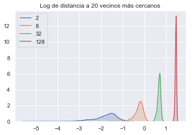

## Introducción

#### La maldición de la dimensionalidad

Hacer matemáticas en dimensiones altas es complicado. Richard Bellman (1957) se refirió a las dificultades que surgen cuando en programación dinámica el espacio de estados tiene dimensión grande como *maldición de la dimensionalidad*, pues las posibles respuestas aumentan exponencialmente.  Para poner el problema en contexto estadístico, presentamos dos ejemplos.

Supongamos que se cuenta con una muestra $\mathbf{X} \in \mathcal{M}_{n\times p}(\mathbb{R})$  ($p$ es muy grande) de puntos distribuidos de manera uniforme en un hipercubo unitario de dimensión $ p$ anclado en el origen, y que sin pérdida de generalidad, interesa estudiar una vecindad del origen. Si localidad se define en el sentido capturar una proporción $r$ de los puntos cercanos al origen con otro cubo más pequeño, sólo necesitamos determinar la longitud $L$ de cada arista. Como cada coordenada es uniforme, esto significa que $r = \mathbb{E}\left[\mathrm{Vol}(\mathrm{cubo})\right]$ y todas son independientes entre sí,  $r = \mathbb{E}[L^p] = \mathbb{E}^p[L]$, por lo que en promedio necesitamos aristas de longitud $r^{1/p}$. Para visualizar la magnitud de este problema,  basta pensar en la siguiente tabla:

| $r$  | $p$  | $\mathbb{E}[L]$ |
| :--: | :--: | :-------------: |
| 0.05 |  10  |      0.741      |
| 0.05 | 100  |      0.970      |
| 0.1  |  10  |      0.794      |
| 0.1  | 100  |      0.977      |

 Desde otra perspectiva, supongamos que tenemos una muestra $\mathbf{X}$ distribuida de manera uniforme en una $\|\cdot \|_2$-bola unitaria. Esto ocurre, por ejemplo en un modelo $X_i \sim \mathcal{N}_p(\mu, \mathbb{I})$; y sin pérdida de generalidad podemos hacer $\mu = 0$.  La distancia de $\mu$ a su punto más cercano está dada por [2]
$$
d(p, n) = \left( 1 - \frac{1}{2}^{1/n}\right)^{1/p}
$$
y llenando datos como arriba vemos que en casos perfectamente factibles como $n=500$ y $p=10$, $d \approx 0.52$, por lo que el punto más ceracno al origen está más cerca de la frontera de la región de interés que del origen mismo. Estos problemas disminuyen la efectividad de los métodos no paramétricos en dimensiones altas.

Como último ejemplo, simulamos en Python puntos uniformes en dimensiones 2, 8, 32 y 128 para comparar las distancias (en logaritmo) a sus vecinos más cercanos.

#### Distintos enfoques 

Algunos métodos muy populares en reducción de dimensionalidad incorporan la no-linealidad con herramientas topológicas. La *hipótesis de la variedad* supone que los datos $p$ dimensionales en realidad están una variedad (intuitivamente, un espacio localmente plano) $q$  dimensional con $q\ll p$.  En una vecindad de cada punto podemos calcular las distancias de manera usual, pero su extensión a la variedad completa tiene que considerar de alguna manera la estructura topológica y en algunos algoritmos la estructura geométrica. Aunque los detalles cambian,  algoritmos como los eigenmapas laplacianos, *locally linear embeddings* y isomap sólo consideran las distancias directas localmente. A diferencia del escalamiento multidimensional que usa una matriz entre todas las observaciones, estos algoritmos la utilizan sólo en una vecindad de cada punto (encontrada, por ejemplo, con kNN) y la extienden usando elementos de teoría de gráficas como caminos más cortos y teoría espectral para aproximar la variedad de manera discreta. ^[1]^ 

Esta hipótesis no es descabellada en la práctica. Consideremos por ejemplo el famoso dataset MNIST. 

La base completa consiste en 70,000 imágenes de dígitos escritos a mano. De alguna manera sabemos que no hay más que 10 elementos distintos en ese espacio, tal vez rotados y distorsionados según la escritura de cada persona. Esta idea puede formalizarse en una función de coordenadas locales para representar imágenes, precisamente en el lenguaje de las variedades topológicas. 

En este proyecto presentaremos un algoritmo que preserva la estructura local de los datos para conseguir muy buenos resultados en reducción de dimensionalidad, y discutiermos brevemente un segundo algoritmo que combina la preservación de estructura global y local.

###### Notación

A lo largo de este documento, trabajamos con una muestra aleatoria $\mathbf{X} \in \mathcal{M}_{n\times p}$ , donde la fila $i$ corresponde a la observación $\mathbf{x}_i = (x_{i1}, x_{i2}, \cdots, x_{ip})^\top$. Buscamos inmersiones $ \mathbf{y}_i =\mathbf{y}(\mathbf{x}_i)\in\mathbb{R}^q$ y nos limitamos a $q \in \{2, 3\}$.  