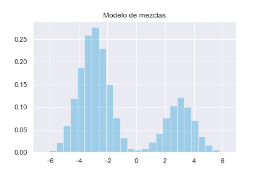
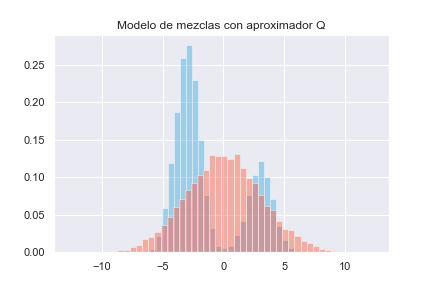
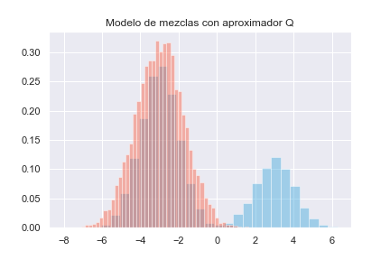

# Apéndice A: La divergencia de Kullback-Leibler

Como vimos en el texto principal, la divergencia de Kullback-Leibler  juega un rol importante en la inferencia variacional, pues el problema se reduce a resolver (o al menos aproximar)
$$
q^* = \arg\min_\mathcal{Q}\{D_{KL}(q||p(\cdot|\mathbf{X}))\}
$$
En este documento se explora de manera intuitiva la divergencia de Kullback-Leibler desde múltiples perspectivas, incluyendo su primera aparición en el paper que introdujo la *prior* de Jeffreys.

## Teoría de la información

Desde los años treinta, y sobre todo con el advenimiento de la segunda guerra mundial, hubo mucho interés en estudiar criptografía probabilísticamente. En este contexto, la teoría de la información comenzó en 1948 con la publicación de un paper de [Claude Shannon](https://en.wikipedia.org/wiki/Information_theory) titulado *Una teoría matemática de la comunicación*.$^{[A1]}$ 

Desde el paper original, Shannon alude a la teoría desarrollada medio siglo antes por Ludwig Boltzmann, de donde toma el término *entropía*. Shannon define la entropía $H$ de una variable aleatoria discreta con soporte finito y masa $p$ 
$$
H(p) = -\sum_xp(x)\log p(x)
$$
Buscaba en $H$ una manera de medir qué tan seguros estamos de los valores de una muestra, conociendo su distribución. La idea es aprovechar la estructura $\sigma$-aditiva del espacio de probabilidad subyacente para dar información "dual" a la probabilidad: los eventos más raros (de probabilidad más pequeña) deberían dar más información. Puede probarse que la función que resuelve este problema es
$$
I(x) = \log \left( \frac{1}{p(x)}\right)
$$

Y con esta notación (que aunque aquí se vea rara, será útil más adelante),
$$
H(p) = \mathbb{E}[I(X)]
$$
A $I$ se le llama *contenido de información*. (Como nota, la base del logaritmo es irrelevante, pero usualmente se toma $2$ para bits o $e$ para unidades naturales).

Algunas observaciones pertinentes:

1. $H$ es no negativa
2. $H$ es cero si y sólo si $X$ toma un valor con probabilidad 1.
3. $H$ es máxima cuando todos los eventos son equiprobables, pues la información inicial es mínima .y los datos deben de algún modo proporcionar "la mayor información posible".
4. Si $X_1$ y $X_2$ son muestras independientes, su entropía total es la suma de ambas entropías.

Para entender mejor esta función, y conectarla con la divergencia de Kullback-Leibler, seguimos el camino de [A2].

## Teoría de códigos

Sea $\mathcal{C}$ un *corpus* de palabras  que quiere encriptarse con un código binario de manera que no haya ambiguedad en los textos. Es decir, `0` y `01` no pueden ser palabras distintas, porque en `00110`  no se sabría cuál es la primera palabra. Una manera de logralo es usar *códigos prefijo*, en los cuales ninguna palabra puede ser prefijo de otra. Pero hay un precio a pagar: las palabras cortas nos obligan a tener palabras largas. Si usamos una palabra de longitud $\ell$, no podemos usar $ c(\ell)=\frac{1}{2^\ell}$ de las posibles palabras de longitud $\ell + 1$ porque causarían ambiguedad [(Kraft-McMillan)](https://en.wikipedia.org/wiki/Kraft–McMillan_inequality). 

Sea $L(x)$ la longitud de la palabra $x \in \mathcal{C}$ en nuestra representación binaria. La longitud de un mensaje $M$ sería $\sum_{x \in M} n_x L(x)$ , donde $n_x$ es el número de veces que $x$ aparece en el mensaje. Si supiéramos que  la palabra $x_i$ ocurre con probabilidad $p_i$ en los textos que nos interesan, podemos asignar $L(x_i)$ inteligentemente para minimizar.

Notemos que se puede invertir el costo, de manera que la longitud de una palabra con un costo dado $r$ es $c^{-1}(r) = \log_2(\frac{1}{r})$.

>  **Teorema**
>
> La regla óptima en el sentido de minimización es asignar $L(x) = \log_2{\frac{1}{p(x)}}= -\log_2p(x)$  $_\blacksquare$.  

Partiendo del teorema y un mensaje $M$, si tuviéramos el código óptimo para expresar eventos con masa $p$, hay un límite a qué tan pequeñas podemos hacer, en promedio, la longitud de $M$: la *entropía*.
$$
H(p)= \sum_xp(x)\log_2p(x)
$$
En el mismo contexto, supongamos que se reciben también mensajes de otro evento en el mismo corpus, esta vez con masa $q$. Si se utilizara el mismo código para enviar mensajes de este evento que del primero, no estaríamos optimizando necesariamente (pues por definición, las las palabras están elegidas para minimizar con respecto a eventos de $p$, y puede haber representaciones largas de palabras frecuentes. 

Usando la construcción anterior de $H$, es natural extenderla a la *entropía cruzada de q con respecto a p*
$$
H_p(q)=-\sum_xq(x)\log p(x)
$$
la longitud promedio de un mensaje que comunica eventos de $q$ usando un código optimizando para $p$. 

> **Observación**
>
> $$H_p(q) \neq H_q(p)$$. 

Finalmente, podemos definir la *divergencia de Kullback-Leibler de* $q$  *a* $p$ como
$$
D_\textrm{KL}(p||q) = H_q(p)-H(p) = -\sum_xp(x)\log_2\left(\frac{q(x)}{p(x)}\right)
$$
y para interpretarlo, notemos que el término con logaritmo es la diferencia de bits que cada representación usaría para representar a la palabra $x$, pues optimizamos los pesos $L$ para $p$.

> **Observaciones**
>
> 1. La divergencia de Kullback-Leibler no es simétrica. Más adalente volvemos a este fenómeno, pero por ahora descartamos la posibilidad de que sea una métrica.
> 2. Aunque aquí usamos distribuciones discretas, pueden hacerse los cambios usuales para trabajar con variables aleatorias continuas. Formalmente, con variables continuas el término es *entropía diferencial*, y cambia por las tecnicalidades de usar una densidad de probabilidad y no una masa.

## Información de discriminación

La divergencia de Kullback-Leibler también tiene una interpretación en contrastes de hipótesis, y de hecho, Kullback la llamaba por ese nombre$^{[A3]}$: *Información de discriminación*.  Fue Trevor Hastie quien popularizó el término "Divergencia de Kullback-Leibler", pero Kullback nunca se refiere a ella así en su libro [A4], de donde tomamos esta exposición.  (De hecho, usa el término *divergencia* para una versión simetrizada de lo que nosotros usamos).

Supongamos que quieren contrastarse las hipótesis
$$
H_1: X\sim f_1 \ \ vs. \ H_2: X\sim f_2
$$
Cuando medimos que $X=x$,  del teorema de Bayes,
$$
\log\frac{f_1(x)}{f_2(x)} = \log \frac{\mathbb{P}(H_1|X=x)}{\mathbb{P}(H_2|X=x)} - \log \frac{\mathbb{P}(H_1)}{\mathbb{P}(H_2)}
$$
El lado derecho de la expresión de arriba es una medida de la diferencia en información antes y después de considerar $X=x$, y al izquierdo, logaritmo del cociente de verosimilitudes lo nombramos *la información para discriminar en favor de* $H_1$ *y en contra de* $H_2$  

Sea $F_1$ la distribución de $X$ bajo $F_1$.  Podemos calcular la *información media por observación de $F_1$ para discriminar en favor de  $H_1$ y en contra de* $H_2$:  
$$
I(F_1||F_2)=
\mathbb{E}\left[\log\frac{f_1(x)}{f_2(x)}\right] =
\int_\mathcal{X}\log\frac{\mathbb{P}(H_1|X=x)}{\mathbb{P}(H_2|X=x)}dF_1 - \log\frac{\mathbb{P}(H_1)}{\mathbb{P}(H_2)}
$$
Pues
$$
\int_\mathcal{X}\log\frac{\mathbb{P}(H_1|X=x)}{\mathbb{P}(H_2|X=x)}dF_1 = \int_\mathcal{X}\log\frac{f_1(x)\mathbb{P}(H_1)}{f_2(x)\mathbb{P}(H_2)}dF_1 =
\int_\mathcal{X}\log\frac{f_1(x)}{f_2(x)}dF_1 + \frac{\mathbb{P}(H_1)}{\mathbb{P}(H_2)}\int_\mathcal{X}dF_1
$$
Y esto no es otra cosa que $D_{KL}(F_2||F_1)$: la divergencia de Kullback-Leibler de $F_1$ a $F_2$. 

## Ganancia de información

En aprendizaje de máquina, la *información ganada sobre* $X$  *por observar que* $A=a$ es
$$
IG_{X|A}(X,a)=H(F_X)-H(F_x|A=a)
$$
donde $H$ es la entropía de Shannon y $H(\cdot | A)$ es la *entropía condicionada a* $A$ (que se define de manera muy natural con la formulación de contenido de información: $\mathbb{E}[I(X)|A=a]$). Como es de esperar, también hay una conexión rápida a la divergencia de Kullback-Leibler:
$$
IG_{X|A}(X,a) = D_{KL}(P_X(x|A=a)||P_X(x|I))
$$
La información ganada es la divergencia de Kullback-Leibler de la *a priori* de X a la posterior de $X$ dado $A$, y mide qué tanta "certidumbre" ganamos . (en forma de información del fenómeno). Claro que esta discusión induce naturalmente la extensión bayesiana.

En este punto conviene introducir la expresión equivalente
$$
D_{KL}(p||q) = \mathbb{E}[\log p-\log q]
$$
y se lee como "los bits de información perdidos, en promedio".

##Extensión bayesiana

Si hacemos $A=\theta$ con la notación usual de un modelo, estamos midiendo la información que ganamos por usar la posterior y no la *a priori*. Desde otro ángulo, $D_{KL}(P||Q)$ es la cantidad de información que perdemos por estimar a $P$, la verdadera posterior, con $Q$. 

## Máxima verosimilitud

También hay un camino frecuentista para construir la divergencia$^{[A5]}$. 

Sea $\underline{X}_{(n)}$ una muestra aleatoria de $X\sim q$, y supóngase que tenemos dos modelos para $q$: $p_0$ y $p_1$. La estadística de cociente de verosimilitudes es
$$
\Lambda = \prod_{i=1}^n\frac{p_1(x_i)}{p_0(x_i)}
$$
Y para normalizar con respecto al número de observaciones, se toma
$$
\dot{\Lambda}_n = \frac{1}{n}\sum_{i=1}^n\log\frac{p_1(x_i)}{p_0(x_i)}
$$
Por la ley fuerte de los grandes números, $\dot{\Lambda}_n \xrightarrow{c.s} \mathbb{E}[\dot{\Lambda}]$, donde $\dot{\Lambda}$ tiene densidad $f(x) = \log p_1(x)-\log p_0(x)$. Haciendo la cuenta,
$$
\mathbb{E}[\dot{\Lambda}] = D_{KL}(q||p_0)-D_{KL}(q||p_1)
$$
Es decir, la prueba de cociente de verosimilitud elige comparando la diferencia entre ambas divergencias (la diferencia en la cantidad de información perdida por aproximar con otra densidad) con el valor $\lambda$ de la estadística de prueba. Además, cuando $\lambda=0$ elige el modelo más "cerca" de  $q$ en el sentido de Kullback-Leibler.

## Geometría de la información

En casi todos los contextos estudiados, la divergencia de Kullback-Leibler mide una especie de distancia o similaridad entre distribuciones. Sin embargo, no es simétrica, y entonces no puede ser una métrica en la forma obvia. Más aún: no satisface la desigualdad del triángulo (por lo que pueden pasar cosas como perder información mientras más observaciones se tengan, en el contexto bayesiano).  

Por suerte, la intuición de medir distancia sí puede usarse, pero en un espacio un poco más complicado. Curiosamente, fue en este contexto geométrico cuando por primera vez se introdujo la divergencia de Kullback-Leibler, y fue en el importante paper de Harold Jeffreys *Una forma invariante para la a priori en problemas de estimación*$^{[7]}$, donde introdujo su *a priori* no informativa.

Una *variedad topológica* es un espacio localmente plano. (Formalmente, es un espacio Hausdorff paracompacto localmente homeomorfo a $\mathbb{R}^m$, y $m$ es su *dimensión*). La noción más inmediata del concepto es el planeta tierra: aunque vivimos en una esfera, localmente parece plano. Sólo cuando vemos al horzionte se nota la curvatura.

Una variedad es *suave* si la transición entre los homeomorfismos es infinitamente diferenciable. Una variedad suave es *Riemanniana* si en el espacio tangente a cada punto (intuitivamente piense en la derivada, algo plano que aproxima localmente) hay un producto interno definido y la transición entre ellos (de punto a punto) es diferenciable. Esta estructura permite definir *geodésicas* en una variedad riemanniana: la extensión natural de recta como "trayectoria más corta entre dos puntos".

La geometría de la información considera variedades riemannianas donde cada punto es una medida de probabilidad (*variedades estadísticas*). Su producto interno correspondiente es la matriz de información de Fischer en cada punto, que bajo algunas condiciones de regularidad tiene entradas
$$
\mathcal{I}(\theta)_{ij} = - \mathbb{E}\left[\frac{\partial^2}{\partial\theta_i\partial\theta_j}f(x;\theta) | \theta\right]
$$
Y haciendo la cuenta, la matriz de Fisher resulta ser en cada punto la Hessiana de la divergencia de Kullback-Leibler. Esto por fin formaliza (si uno en serio se avienta le geometría diferencial) la idea de medir cercanía: 

>La distancia infinitesimal entre dos puntos en una variedad estadística es, salvo un error de orden cúbico, la diferencia de información entre ellos: su divergencia de Kullback-Leibler.

La geometría de la información se dedica a estudiar esta conexión entre geometría diferencial y estadística. ¿Por qué suponer que los espacios de parámetros son planos si un modelo puede ser mejor que otro de maneras altamente no lineales? La divergencia de Kullback-Leibler como métrica riemanniana permite optimizar considerando la geometría intrínseca de qué tanto es mejor un modelo con respecto a otros.

## Selección de modelos: la información de Akaike

En un modelo estadístico donde se estiman $k$  parámetros a entrenar con una logverosimilitud $l​$  como función pérdida, el *criterio de información de Akaike*  es 
$$
\textrm{AIC}=2k-2\ell^*
$$
donde $\ell ^*$ es la logverosimilitud evaluada en los estimadores máximoverosímiles de la muestra. El AIC recompensa la bondad de ajuste a través de la logverosimilitud y penaliza la compledijdad a través de $k$, pues se elige el modelo con menor AIC.

Imaginemos que los datos vienen de un proceso $g$, y que tenemos una muestra tamaño $n$. Queremos estimar a  a $g$ con un elemento de una familia paramétrica $\mathcal{F}=\{f_\theta:\theta\in\Theta\}$. 

Bajo ciertas condiciones,
$$
\frac{1}{n}\sum_{i=1}^n\log f_\theta(x_i) \xrightarrow{a.s}S(g;f_\theta) = \mathbb{E}_g[\log f_\theta(X)]
$$
Como el estimador máximo verosimil alcanza asintóticamente la cota de Cramer y Rao, Akaike propuso medir elegir $f_\theta$ que mejor aproxime a $g$ minimizando 
$$
I(g\ ;f_\theta):=S(g;g)-S(g;f_\theta) = D_{KL}(g||f_\theta)
$$
La expresión de en medio quiere decir "elegir la $f_\theta$  más cercana de $g$ en logverosimilitud media". Por suerte, conociendo las construcciones anteriores de la divergencia de Kullback-Leibler, tenemos una equivalente: "elegir la la $f_\theta$ que pierda menos información al representar un proceso que viene de $g$".

Por suerte, no tenemos que conocer $g$ para elegir a $f_\theta$.  Supongamos que $g=f_{\theta_0}$.  Usando la interpretación geométrica de la divergencia, sabemos que para $\theta$ cercanos a $\theta_0$, puede aproximarse $2D_{KL}(f_{\theta_0}||f_{\theta_0+\Delta\theta})\approx\Delta\theta'F\Delta\theta$, donde $F$ es la matriz de información de Fisher. En particular, como el estimador máximverosimil es asintóticamente eficiente, sucede cuando $\theta=\hat\theta_{MV}$. 

Supongamos que ahora interesa el mejor $\theta \in \Upsilon \subseteq \Theta$, donde $,\theta_0 \not\in \Upsilon$ y sea $\hat\theta$ tal estimador. Si $\dot\theta \in \Upsilon$ maximiza $S(f_{\theta_0};f_\theta)$ y está suficientemente cerca de $\hat\theta$, 
$$
n(\dot\theta_0-\hat\theta)'F(\dot\theta_0-\hat\theta)\ \dot\sim\ \chi^2_k
$$
donde $r=\dim\Upsilon$.  Se puede probar que 
$$
\mathbb{E}[2nI(f_{\theta_0};f_{\hat\theta})]= n(\dot\theta-\theta_0)'F(\dot\theta-\theta_0)+k
$$
Lo que queremos es elegir el modelo que minimice la divergencia de Kullback-Leibler, por lo que habría que encontrar una manera de estimar la media de arriba. Cuando los modelos tienen $\dot\theta$ cerca de $\hat\theta$, puede usarse como estimador
$$
n(\dot\theta-\theta_0)'F(\dot\theta-\theta_0)\approx2\left(\sum_{i=1}^n\log f(x_i|\theta_0)-\sum_{i=1}^n\log f(x_i|\hat\theta)\right)
$$

pero hay que corregir por haber utilizado $\hat\theta$ en vez de $\dot\theta$. Para esto, se le suma $k$. Para elegir entre modelos,  la suma con $\theta_0$ se vuelve irrelevante, por lo que basta elegir el que tenga el más chico valor de 
$$
-2\sum_{i=1}^m\log f(x_i|\hat\theta)+2k=\textrm{AIC}
$$
Así pues, elegir el mínimo criterio de Akaike es minimzar la divergencia de Kullback-Leibler entre nuestro modelo y los datos originales, dentro de una misma familia paramétrica. Nótese que esto quiere decir que si $g$ no está cerca de ser una $f_\theta$, el criterio de Akaike **no** lo informa. 

## La asimetría de $D_{KL}$

Aún con todas las interpretaciones de la divergencia de Kullback-Leibler que hemos visto, no tenemos todavía una manera naturalmente probabilística de entender la diferencia entre $D_{KL}(P||Q)$ (a la que llamaremos *divergencia hacia adelante*)  y $D_{KL}(Q||P)$ (*divergencia hacia atrás*). 

De la expresión 
$$
D_{KL}(P||Q) = \int_\mathcal{X}\log\frac{dP}{dQ}dP=\int_\mathcal{X}p(x)\log\frac{p(x)}{q(x)}dx
$$
Vemos que cuando $p(x)=0$, no importa qué valor tome $q(x)$, pero en los valores con $p(x)>0$, nos interesa que la razón entre $p(x)$ y $q(x)$ sea lo más cercana posible a $1$. Minimizar la divergencia hacia adelante evita asignar $q(x)=0$ a valores $x$ con $p(x)>0$. Llamaremos a esta estrategia "evitar ceros". 

Por otra parte, cuando minimizamos
$$
D_{KL}(Q||P) = \int_\mathcal{X}\log\frac{dQ}{dP}dQ=\int_\mathcal{X}q(x)\log\frac{q(x)}{p(x)}dx
$$
podemos asignarle probabilidad casi cero a los lugares donde $p$ es grande sin miedo, pero cuando sí asignemos probabilidad, de nuevo tienen que ser lo más cerca posible de la razón unitaria. Esta estrategia permite a algunas $x$ tener $q(x)=0$ aunque $p(x)>0$ si es necesario para minimizar la divergencia, por lo que parte de soporte original queda sin modelar. Llamaremos a esta estrategia "forzar ceros".

A continuación la desarrollamos a partir de un ejemplo. 

Sea $\mathbf{X}_{(n)}$ una muestra aleatoria del modelo de mezclas
$$
Y \sim \textrm{Bernoulli}(0.3) \\
X|Y=0 ~ \sim \mathcal{N}(-3, 1) \\
X |Y=1 \sim \mathcal{N}(3,1)
$$
y sea $P$ su distribución. 

Supongamos que alguien intenta estimar a $P$ con una única distribución normal. Por las observaciones de arriba, una manera de cubrir el soporte de $P$ con estrategia  es uar  $Q = \mathcal{N}(0,9.86)​$. Así evitamos ceros: asignamos probabbilidad positiva (y parecida) a los lugares con probabilidad positiva.

Usando esta $Q$,  $D_{KL}(P||Q) \approx 0.41$ y $D_{KL}(Q||P) \approx 0.53$.

Si nos interesara forzar ceros, sería mejor cubrir la campana pequeñita de $P$ con una normal, para que las colas queden en las áreas de probabilidad baja.  Todavía mejor sería usar una $t$, para que las colas absorban más de la probabilidad y con eso lleguemos a la otra campana en el caso favorable. Aunque usar una $t$ hace que los resultados de arriba y los de ahora ya no sean comparables (pues en un proceso de inferencia variacional la normal y la $t$ no están naturalmente en la misma familia), nos permitirá mostrar con más precisión el cambio en optimalidad. 

 

Aquí, $D_{KL}(P||Q) \approx 0.53$ y $D_{KL}(Q||P) \approx 0.87$. Efectivamente, este tipo de aproximación minimiza la divergenia hacia atrás.

¿Cómo podemos interpretar esto? Cuando en inferencia variacional minimizamos $D_{KL}(Q||P)$, estamos implícitamente estamos sentando preferencia por soluciones como la de abajo, que modela bien partes de $P$ aunque pueda asignarle probabilidad 0 a valores del soporte original. 

## Referencias

[A1] Shannon, C. E. (1948). *A Mathematical Theory of Communication*. Bell System Technical Journal, 27(3), 379–423. doi:10.1002/j.1538-7305.1948.tb01338.x

[A2] http://colah.github.io/posts/2015-09-Visual-Information/

[A3] (1987) Letters to the Editor, The American Statistician, 41:4, 338-341, DOI: 10.1080/00031305.1987.10475510

[A4] Kullback, Solomon. *Information Theory and Statistics*. Dover Publications, 1997.

[A5] Jonathon Shlens. *Notes on Kullback-Leibler Divergence and Likelihood*, 2014; [http://arxiv.org/abs/1404.2000 arXiv:1404.2000].

[A6] Jeffreys, Harold. *An invariant form for the prior probability in estimation problems*. Proc. R. Soc. Lond. A 1946 186 453-461; DOI: 10.1098/rspa.1946.0056. Published 24 September 1946