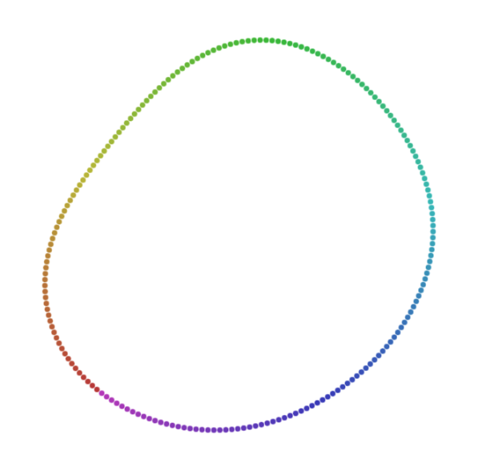
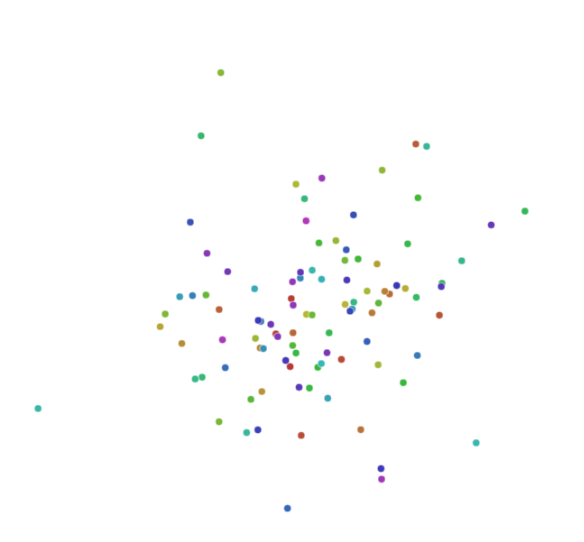
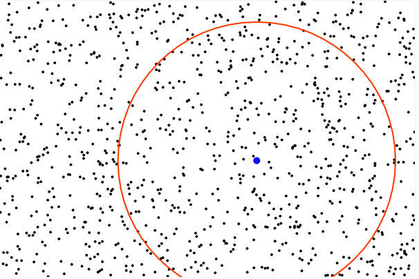
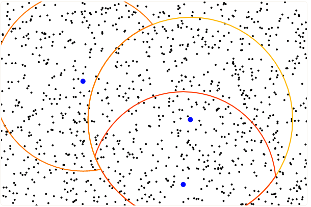
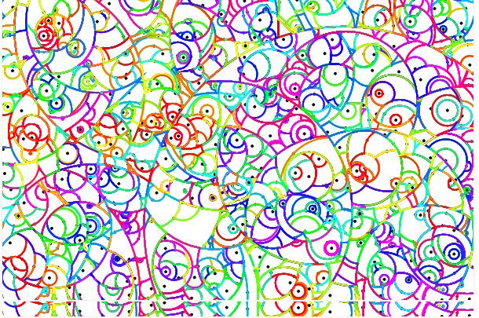
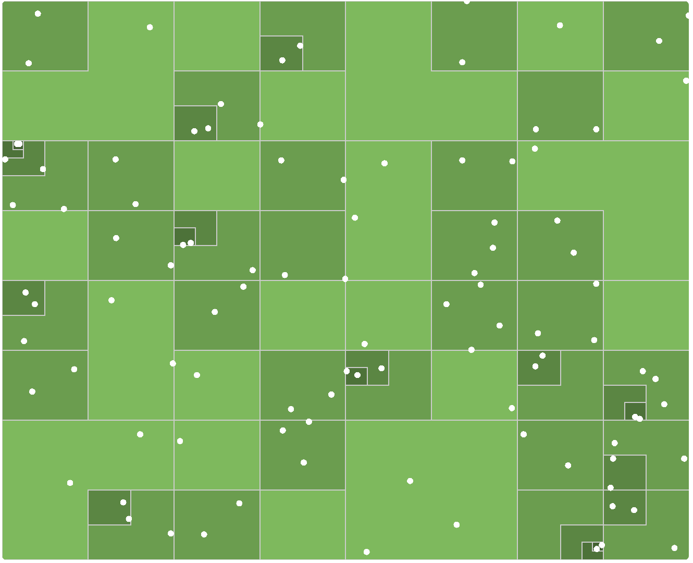

# Reducción de dimensionalidad con  t distributed stochastic neighbor embedding (t-SNE)

## Introducción

#### La maldición de la dimensionalidad

Hacer matemáticas en dimensiones altas es complicado. Richard Bellman (1957) se refirió a las dificultades que surgen cuando en programación dinámica el espacio de estados tiene dimensión grande como *maldición de la dimensionalidad*, pues las posibles respuestas aumentan exponencialmente.  Para poner el problema en contexto estadístico, presentamos dos ejemplos.

Supongamos que se cuenta con una muestra $\mathbf{X} \in \mathcal{M}_{n\times p}(\mathbb{R})$  ($p$ es muy grande) de puntos distribuidos de manera uniforme en un hipercubo unitario de dimensión $ p$ anclado en el origen, y que sin pérdida de generalidad, interesa estudiar una vecindad del origen. Si localidad se define en el sentido capturar una proporción $r$ de los puntos cercanos al origen con otro cubo más pequeño, sólo necesitamos determinar la longitud $L$ de cada arista. Como cada coordenada es uniforme, esto significa que $r = \mathbb{E}\left[\mathrm{Vol}(\mathrm{cubo})\right]$ y todas son independientes entre sí,  $r = \mathbb{E}[L^p] = \mathbb{E}^p[L]$, por lo que en promedio necesitamos aristas de longitud $r^{1/p}$. Para visualizar la magnitud de este problema,  basta pensar en la siguiente tabla:

| $r$  | $p$  | $\mathbb{E}[L]$ |
| :--: | :--: | :-------------: |
| 0.05 |  10  |      0.741      |
| 0.05 | 100  |      0.970      |
| 0.1  |  10  |      0.794      |
| 0.1  | 100  |      0.977      |

 Desde otra perspectiva, supongamos que tenemos una muestra $\mathbf{X}$ distribuida de manera uniforme en una $\|\cdot \|_2$-bola unitaria. Esto ocurre, por ejemplo en un modelo $X_i \sim \mathcal{N}_p(\mu, \mathbb{I})$; y sin pérdida de generalidad podemos hacer $\mu = 0$.  La distancia de $\mu$ a su punto más cercano está dada por [2]
$$
d(p, n) = \left( 1 - \frac{1}{2}^{1/n}\right)^{1/p}
$$
y llenando datos como arriba vemos que en casos perfectamente factibles como $n=500$ y $p=10$, $d \approx 0.52$, por lo que el punto más ceracno al origen está más cerca de la frontera de la región de interés que del origen mismo. Estos problemas disminuyen la efectividad de los métodos no paramétricos en dimensiones altas.

Como último ejemplo, simulamos en Python puntos uniformes en dimensiones 2, 8, 32 y 128 para comparar las distancias (en logaritmo) a sus vecinos más cercanos.


#### Distintos enfoques 

Algunos métodos muy populares en reducción de dimensionalidad incorporan la no-linealidad con herramientas topológicas. La *hipótesis de la variedad* supone que los datos $p$ dimensionales en realidad están una variedad (intuitivamente, un espacio localmente plano) $q$  dimensional con $q\ll p$.  En una vecindad de cada punto podemos calcular las distancias de manera usual, pero su extensión a la variedad completa tiene que considerar de alguna manera la estructura topológica y en algunos algoritmos la estructura geométrica. Aunque los detalles cambian,  algoritmos como los eigenmapas laplacianos, *locally linear embeddings* y isomap sólo consideran las distancias directas localmente. A diferencia del escalamiento multidimensional que usa una matriz entre todas las observaciones, estos algoritmos la utilizan sólo en una vecindad de cada punto (encontrada, por ejemplo, con kNN) y la extienden usando elementos de teoría de gráficas como caminos más cortos y teoría espectral para aproximar la variedad de manera discreta. ^[1]^ 

Esta hipótesis no es descabellada en la práctica. Consideremos por ejemplo el famoso dataset MNIST. 


La base completa consiste en 70,000 imágenes de dígitos escritos a mano. De alguna manera sabemos que no hay más que 10 elementos distintos en ese espacio, tal vez rotados y distorsionados según la escritura de cada persona. Esta idea puede formalizarse en una función de coordenadas locales para representar imágenes, precisamente en el lenguaje de las variedades topológicas. 

En este proyecto presentaremos un algoritmo que preserva la estructura local de los datos para conseguir muy buenos resultados en reducción de dimensionalidad, y discutiermos brevemente un segundo algoritmo que combina la preservación de estructura global y local.

## t-Distributed Stochastic Neighbor Embedding (t-SNE)

t-SNE es una técnica de visualización desarrollada en 2008 por Laurens Van der Maaten y Geoffrey Hinton que consiste en visualizar datos en altas dimensiones al asignar a cada punto una localización en el espacio euclidiano de 2 o 3 dimensiones. Dicha técnica surge como una mejora a SNE (Stochastic Neighbor Embedding) al tener un gradiente más sencillo de optimizar y que resuelve el *problema de aglutinamiento*. A continuación presentamos t-SNE y la optimización de Barnes-Hut propuesta por el mismo Van der Maaten en el 2014. Esta técnica permite la escalabilidad del algoritmo a conjuntos de datos más grandes. Actualmente t-SNE es considerada como una de las técnicas de *estado del arte* para visualización y reducción de dimensión.

#### Stochastic Neighbor Embedding (SNE)

Al igual que en escalamiento multidimensional, en SNE definimos una medida de similaridad. A saber, el vecino más cercano de $\bold{x}_i$ es el punto $\bold{x}_j$ con mayor probabilidad bajo una distribución normal  centrada en $\mathbf{x}_i$ con varianza $\sigma_i^2\mathbb{I} $. Como la varianza depende de $i$, esta similaridad es asimétrica. Formalmente
$$
\begin{align}
p_{j\vert i} &= \frac{\exp\left(-\Vert \bold{x}_i - \bold{x}_j \Vert^2 / 2\sigma_i^2 \right)}{\sum\limits_{k\not=i}\exp\left(-\Vert \bold{x}_i - \bold{x}_k \Vert^2 / 2\sigma_i^2\right)}
\end{align}
$$
Y $p_{i\vert i} = 0$

La varianza $\sigma_i^2$ se calcula determinísticamente a partir de un hiperparámetro especificado por el usuario y de manera que tome valores más pequeños si $\mathbf{x}_i$ se encuentra en una zona de poca concentración $\sigma_i$ y valores más grandes si $\mathbf{x}_i$ se encuentra en una zona de mayor concentración.

Sea $P_i$ la distribución de probabilidad condicional sobre las demás observaciones dada $\mathbf{x}_i$, *la entropía de Shanon* de $P_i$ (para más detalles ver apéndice A) es
$$
H(P_i) := - \sum_j p_{j|i} \log p_{j|i}
$$

Notemos que cualquier valor de la varianza $\sigma_i^2$ induce una distribución de probabilidad $P_i$ cuya entropía $H(P_i)$ es creciente en $\sigma^2_i$. En consecuencia definimos la *perplexity* de $P_i$ como

$$
\mathrm{Perp}(P_i) = 2^{H(P_i)}
$$

Que puede ser interpretada como una medida continua de el número efectivo de vecinos. Así, SNE ejecuta una búsqueda binaria para obtener el valor de $\sigma_i$ que produce una distribución de probabilidad $P_i$ con un valor *perplexity* especificado de antemano por el usuario.

De manera análoga a la construcción de $p_{j|i}$ podemos obtener la densidad condicional $q_{j|i}$ de las $\mathbf{y}_i$ por medio de la siguiente expresión
$$
q_{j\vert i} = \frac{\exp\left(-\Vert \bold{y}_i - \bold{y}_j \Vert^2 \right)}{\sum\limits_{k\not=i}\exp\left(-\Vert \bold{y}_i - \bold{y}_k \Vert^2 \right)}
$$
En constraste con $(1)$ fijamos la varianza de las distribuciones normales correspondientes en $\frac{1}{\sqrt{2}}$.

En caso de que los puntos mapeados $\mathbf{y}_i$ y $\mathbf{y}_j$ modelen de forma correcta la similaridad entre las observaciones $\mathbf{x}_i$ y $\mathbf{x}_j$ debería tenerse que $p_{j|i} = q_{j|i}$. Con base en esta observación, SNE propone minimizar la divergencia de Kullback-Leibler entre las distribuciones condicionales $P_i$ y $Q_i$ (para mayor intuición sobre porque la divergencia de KL surge de manera natural en este contexto, visitar el apéndice A). La función costo C está dada por
$$
C = \sum _i D_{KL} (P_i \Vert Q_i) = \sum_i \sum_j p_{i|j}\log\frac{p_{j|i}}{q_{j|i}}
$$


Para minimizar $C$ utilizaremos el método de descenso por gradiente, a saber
$$
\nabla_{y_i} C = 2 \sum_j (p_{j\vert i} + p_{i \vert j} - q_{j \vert i } - q_{i \vert j})(\mathbf{y}_i - \bold{y}_j)
$$

#### Construcción de t-SNE

SNE presenta dos problemas que reducen considerablemente su uso práctico.

1. La función costo dificil de optimizar.
2. Se presenta el *problema de aglutinamiento* sobre el cual se mencionará más a continuación.

t-SNE surge como alternativa para solucionar estos conflictos.

###### Simetría

Una alternativa (más sencilla) para la función costo surge al añadir simetría a las funciones involucradas en la divergencia de KL. En este caso, en vez de minimizar la suma de las divergencias de KL entre las condicionales $p_{i \vert j}$ y $q_{i \vert j}$ utilizaremos las distribuciones conjuntas
$$
q_{i j} = \frac{\exp\left(-\Vert \bold{y}_i - \bold{y}_j \Vert^2 \right)}{\sum\limits_{k}\sum\limits_{l\not=k}\exp\left(-\Vert \bold{y}_i - \bold{y}_k \Vert^2 \right)}\nonumber \\

p_{i j} = \frac{\exp\left(-\Vert \bold{y}_i - \bold{y}_j \Vert^2 \right)}{\sum\limits_{k}\sum\limits_{l\not=k}\exp\left(-\Vert \bold{y}_i - \bold{y}_k \Vert^2 \right)}
$$
Notemos que si $\mathbf{x}_i$ es un *outlier*, $p_{ij}$ es pequeño para toda $j$, por lo que la influencia de su correspondiente $\mathbf{y}_i$ sobre la función objetivo es practicamente nula y $\mathbf{y}_i$ está poco relacionada con el resto. Esta situación se arregla definiendo la conjunta de $p$ de la siguiente forma
$$
\begin{align}
p_{ij} &= \frac{p_{j\vert i }+p_{i\vert j}}{2n}
\end{align}
$$
Notemos que $\sum_j p_{ij} > \frac{1}{2n} \ \forall i$ de forma que, aún si $\mathbf{x}_i$ es un outlier la influencia sobre la función objetivo de su $\mathbf{y}_i$ es significativa. Así pues, si $P$ y $Q$  son las distribuciones conjuntas la función costo es
$$
C = \sum _i D_{KL} (P \Vert Q) = \sum_i \sum_j p_{ij}\log\frac{p_{ij}}{q_{ij}}
$$
Cuyo gradiente presenta una forma más sencilla que su contraparte asimétrica.
$$
\nabla_{y_i} = 4 \sum_{j} (p_{ij} - q_{ij})(\mathbf{y}_i - \bold{y}_j)
$$


###### Problema de aglutinamiento

El problema de aglutinamiento es una consecuencia de la *maldición de la dimensionalidad*, la forma más sencilla de presentarlo para el caso particular que estamos enfrentando es la siguiente. Supongamos que el espacio original está en $n$ dimensiones y se quiere realizar un mapeo a un espacio de dimensión $p \ll n$., notemos que si hay $n+1$ puntos $\mathbf{x}_1, ..., \mathbf{x}_{n+1}$ equidistantes entre sí no hay forma de preservar esta propiedad en dimensiones menores a $n$.

En general, dado que el mapeo propuesto por SNE prioriza la preservación de distancias pequeñas, muchos de los puntos que se encuentran a distancias moderadas de $\mathbf{x}_i$ serán mapeados a puntos que se encuentran distantes de $\mathbf{y}_i$ pues, como se mencionó en la introducción, una consecuencia de la maldición de la dimensionalidad es que en el espacio bajo-dimensional *tenemos menos espacio*. Todos estos puntos ejercen una fuerza atractiva (pequeña pero considerable) hacia $\mathbf{y}_i$ que, si se acumula, termina por eliminar los espacios que inicialmente se habían formado entre los clusters naturales de los datos.

###### Distribuciones de colas pesadas como solución al desajuste entre distancias

Para resolver el problema de aglutinamiento, t-SNE propone utilizar una distribución de colas pesadas  en $\mathbb{R}^q$ de forma que las fuerzas atracticas ocasionadas por la obtención de grandes distancias entre puntos separados moderadamente en el espacio original, puedan ser modeladas en la cola de la distribución.

En este caso se utiliza una distribución $t$ con un grado de libertad (una Cauchy)de forma que
$$
q_{ij} = \frac{(1 + \Vert \mathbf{y}_i - \bold{y}_j \Vert)^{-1}}{\sum\limits_k\sum\limits_{l\not = k}(1 + \Vert \bold{y}_k - y_l \Vert^2)^{-1}}
$$
Con dicho cambio, el gradiente de la nueva función costo está dado por
$$
\nabla_{y_i}C = 4\sum_j (p_{ij} - q_{ij})(\mathbf{y}_i - \bold{y}_j) (1 + \Vert \mathbf{y}_i - \bold{y}_j \Vert^2)^{-1}
$$

Las fuerzas repulsivas en el gradiente de t-SNE son mucho mayores que en el gradiente de SNE obteniendo un proceso más equilibrado (a diferencia del proceso predominantemente atractivo que se genera en SNE). Para un análisis más detallado basado en mecánica de partículas ver [6].

El proceso de descenso por gradiente es inicializado en $\mathcal{Y}^0$, una muestra de una distribución normal con media cero y varianza pequeña. Para acelerar el descenso y para evitar caer en mínimos locales se añade una tasa de aprendizaje, $\eta$  y un *momentum* $\alpha$ al gradiente. Esta técnica preserva cierta memoria (que decae exponencialmente) de los gradientes anteriores. El cálculo final es
$$
\mathcal{Y^{(t)}} = \mathcal{Y^{(t-1)}} + \eta \nabla_\mathcal{Y}C + \alpha(t)\left(\mathcal{Y^{(t-1)}} - \mathcal{Y^{(t-2)}}\right)
$$
Los autores recomiendan $\eta=100$ y actualizaciones en cada iteración con el esquema descrito en [7] para actualizar $\eta$. Para $\alpha$, usamos
$$
\begin{cases}
\alpha^{(t)} = .5 \quad \text{si} \ t<250 \\ \nonumber
\alpha^{(t)} = .8 \quad \text{si} \ t\geq250 \\
\end{cases}
$$

###### Algoritmo: t-SNE

```pseudocode
t-SNE(data=x, perp=30, T=1000, alpha=alpha(t) nu=100):
""" t-SNE: t-Distributed Stochastic Neighbor Embedding.

	Parámetros:
	-----------
	data (data frame):
		Las observaciones {x_1, ... x_n}.
	perp (double):
		Perplexity.
	T (int):
		Número de iteraciones
	nu (real):
		Tasa de apendizaje
	alpha (function):
		Momentum
	Regresa:
	--------
	Y (arreglo):
		Mapeo en bajas dimensiones de los datos originales
"""

	p(i|j) <- Calcula (1) utilizando la perp para obtener las varianzas
	p(i,j) <- Calcula (7)
	Y <- Obten una muestra de una distribución con media cero y varianza 1e-4

	for t=1 hasta T:
		q(i,j) <- Calcula (10)
		grad_yi(C) <- Obtén (11)
		Y <- Calcula la actualización (14)

	return (Y)
```

###### Comentarios sobre perplexity

Como mencionamos, la *perplexity* puede ser interpretada como el número efectivo de vecinos. Valores muy pequeños de esta harán que el algoritmo se concentre únicamente en la estructura local y pierda completamente la noción de estructura global, mientras que para valores muy altos, la inmersión es deficiente y en ciertas ocasiones no se logra la convergencia.

A continuación se presentan las visualizaciones obtenidas tras ejecutar t-SNE donde los puntos en el espacio original se encuentran distribuidos sobre un nudo trefoil en 3 dimensiones.

|  |  |  |
| :-----------------------------------: | :-----------------------------------: | :-----------------------------------: |
|               Perp = 2                |               Perp = 30               |              Perp = 100               |

###### Algunas optimizaciones para el algoritmo

- *Early compression:* La idea es forzar a que durante las primeras iteraciones los puntos mapeados se mantengan a distancias pequeñas entre sí, de esta forma es más fácil que los clusters se muevan dentro de todo el espacio correspondiente al mapeo y que se pueda encontrar una organización global para los datos. Esto se implementa añadiendo una penalización adicional a la función costo que es proporcional a la suma de las distancias al cuadrado entre los puntos mapeados y el origen durante las primeras iteraciones.

- *Early exaggeration:* Consiste en multiplicar todas las conjuntas $p_{ij}$ por algún factor fijo, digamos $\beta > 1$, tal que las conjuntas $q_{ij}$ sean pequeñas en comparación con su contraparte $p_{ij}$, de esta forma se obliga a que el proceso de optimización de una menor prioridad a las distancias en el mapeo en bajas dimensiones. En consecuencia hay más espacio libre para que los clusters se puedan mover por todo el espacio y para que los datos se organicen de una mejor manera globalmente.

#### Barnes-Hut-SNE

Barnes-Hut-SNE es una implementación computacional eficiente de t-SNE propuesta por van der Maaten en [8] que permite reducir la complejidad computacional de t-SNE de $O(N^2)$ a $O(N\log N)$.  Para ello comienza por utilizar una estructura de datos de árboles métricos para aproximar P y posteriormente aproxima los gradientes $\nabla_{y_i} C $ utilizando el algoritmo de Barnes-Hut.

###### Aproximando el cálculo de la similaridad

Si $\mathbf{x}_i$ y $\mathbf{x}_j$ son disimilares (lejanos) $p_{j \vert i}$ es muy cercano a cero, en consecuencia podemos realizar una aproximación para el cálculo de $p_{ij}$ definiendo $p_{j \vert i}$ de la siguiente manera
$$
p_{j \vert i} = \begin{cases} \frac{\exp\left(-\Vert \bold{x}_i - \bold{x}_j \Vert^2 / 2\sigma_i^2 \right)}{\sum\limits_{k\in\mathcal{N}_i}\exp\left(-\Vert \bold{x}_i - \bold{x}_k \Vert^2 / 2\sigma_i^2\right)} &\quad \text{Si } j \in \mathcal{N_i}  \\ 
0 &\quad \text{En otro caso}
\end{cases}
$$
Donde $\mathcal{N_i}$ denota los $\lfloor 3u \rfloor$ vecinos más cercanos a $\bold{x}_i$ y $\sigma$ se obtiene de forma que la *perplexity* correspondiente sea $u$. Puesto que únicamente consideramos $\lfloor 3u \rfloor$ observaciones para calcular $p_{ij}$, es de esperar que se mejore sustancialmente el tiempo de ejecución del algoritmo. Sin embargo, para ello se supuso que conocemos los vecinos más cercanos para cada observación $\mathbf{x}_i$. Pese a que ese no es el caso, existe una estructura de datos que nos permite obtener los $k$ vecinos más cercanos a $\mathbf{x}_i$ en $O(\log N)$, de forma que podemos encontrar el conjunto de vecinos más cercanos a todas las $\mathbf{x}_i$  en $O(N\log N )$.

###### Árboles Vantage-Point (Árboles VP)

Los árboles VP son una estructura de datos métrica en la cual cada nodo almacena un objeto, en este caso un punto $\bold{x}_i$, y el radio de una bola con centro en dicho punto. El hijo izquierdo de cada nodo almacena todos aquellos puntos que se encuentren dentro de la bola y el hijo derecho almacena todos aquellos puntos que se encuentran fuera de ella . La construcción del árbol toma $O(N\log N)$ y las búsquedas para obtener los vecinos más cercanos se llevan a cabo en $O(\log N)$. A continuación se muestra visualmente el proceso de construcción.

|  |  |  |
| :---------------------------------: | :---------------------------------: | :---------------------------------: |
|          Primera iteración          |          Segunda iteración          |           Iteración final           |

######Aproximando el cálculo de el gradiente

Sea $Z := (1 + \Vert \mathbf{y}_i - \bold{y}_j \Vert^2)^{-1}$ y recordemos el gradiente de t-SNE para obtener
$$
\begin{align*}
\nabla_{y_i}C &= 4\sum_j (p_{ij} - q_{ij})(\mathbf{y}_i - \bold{y}_j) (1 + \Vert \mathbf{y}_i - \bold{y}_j \Vert^2)^{-1} \\
&= 4 \left( \sum_{j} p_{ij}(\mathbf{y}_i - \bold{y}_j)(1 + \Vert \mathbf{y}_i - \bold{y}_j \Vert^2)^{-1} - \sum_j q_{ij}(\mathbf{y}_i-\bold{y}_j)(1 + \Vert \mathbf{y}_i - \bold{y}_j \Vert^2)^{-1}\right)
\\
&= 4 \left( \sum_{j} p_{ij}q_{ij}(\mathbf{y}_i - \bold{y}_j)Z - \sum_j q_{ij}^2(\mathbf{y}_i-\bold{y}_j)Z\right)
\\
&= 4 (F_{a} - F_{r} )
\end{align*}
$$
$F_{a}$ denota la suma de todas las fuerzas *atractivas* y su cálculo ya es computacionalmente eficiente y puede obtenerse en $O(uN)$ tomando en cuenta $(13)$ y que $q_{ij}Z$ se puede calcular en $O(1)$.

$F_r$ denota la suma de fuerzas repulsivas y hasta el momento su cálculo presenta una complejidad de  $O(N^2)$, a continuación presentamos el algoritmo de Barnes-Hut que nos permitirá reducir la complejidad de la obtención de $F_r$ a $O(N\log N)$.

Considérense 3 puntos $\mathbf{y}_i, \mathbf{y}_j$ y $\mathbf{y}_k$ donde $\Vert \mathbf{y}_i - \mathbf{y}_j \Vert \approx \Vert \mathbf{y}_i - \mathbf{y}_k \Vert \gg \Vert \mathbf{y}_j - \mathbf{y}_k \Vert$. Entonces la diferencia entre las contribuciones de $\mathbf{y}_k$ y de $\mathbf{y}_j$ a $\sum_j q_{ij}^2(\mathbf{y}_i-\mathbf{y}_j)Z$ es prácticamente nula. El algoritmo de Barnes-Hut explota esta idea creando $m $ grupos ($g_1, ... g_n$) de puntos en $\{\bold{y}_j\}_{k\not = i }$ tales que para cada grupo se cumplen las condiciones recién dadas. Podemos estimar $\sum_j q_{ij}^2(\mathbf{y}_i-\bold{y}_j)Z$ con
$$
\sum_{j=1}^m |g_j| \ q_{i,g_j} (\bold{y}_i - y_{g_j})Z_{g_j}
$$
Donde $|g_j|$ es el número de elementos en el grupo $j$, y $q_{i,g_j}$ es la estimación de la densidad $q_{ij}$ en el grupo $j$ (usualmente se toma el centro de masa de los puntos en el grupo $j$ y con base en él se realiza la estimación). De la misma manera estimamos $y_{g_j}$ y $Z_{g_j}$.

Efectivamente, en caso de tener los grupos definidos la estimación reduce considerablemente el tiempo necesario para calcular la expresión correspondiente a las fuerzas repulsivas y por ende la complejidad del algoritmo en general ¿Cómo obtener los grupos y centros de masa correspondientes de manera eficiente? El autor propone utilizar una estructura de datos llamada *quadtree* para resolver dicho problema.

###### Quadtree

*Quadtree* es una estructura de datos de tipo arbol en la cual cada nodo representa una celda rectangular con cierto centro, altura y anchura. Los nodos que no son hojas tienen 4 hijos que subdividen la celda en 4 cuadrantes. Asimismo para cada nodo se almacena el centro de masa de los puntos en esa celda y el número de elementos en ella. A continuación se muestra la división generada por el *quadtree* en el espacio original (lado izquierdo) y el arbol de búsqueda generado (lado derecho).

Usando *quadtrees* podemos encontrar encontrar los grupos de arriba.

|  |  |
| ----------------------------------- | ----------------------------------- |
|                                     |                                     |

#### Ejemplo

A continuación mostramos una visualización interactiva de t-SNE sobre el famoso dataset MNIST.

<iframe height=1010, width=1010, src="https://s3-us-west-2.amazonaws.com/mnist-imgs/t-SNE_MNIST.html"></iframe>
## Clustering y convergencia

A continuación presentamos un estudio realizado por Linderman y Steinerberger [9] que presenta condiciones ideales sobre los datos asi como requisitos sobre la elección óptima parámetros para asegurar la convergencia y la formación de clusters.

###### Recordatorio

Comencemos por expresar el gradiente de la función costo en de la misma forma que en Barnes-Hut-SNE, en función de fuerzas atractivas y repulsivas.

$$
\nabla_{y_i} C = 4 (F_{a} - F_{r})
$$
Asimismo, introduzcamos el coeficiente de exageración $\beta > 1$ correspondiente a el método de descenso por gradiente.
$$
\frac{1}{4}\nabla_{y_i} C = \beta F_{a} - F_{r}
$$
Finalmente, introducimos un paso de tamaño $h > 0 $
$$
\frac{h}{4}\nabla_{y_i} C = \beta F_{a} - F_{r}
$$

###### Suposiciones

1. *Los datos están clusterisados*: existe un número natural $k$ (el número de clusters) y un mapeo que asigna a cada punto a uno de los clusters $\pi : \{1,...n\} \to \{1,...,k\}$  y que cumple

$$
p_{ij} \geq \frac{1}{10n\vert \pi^{-1}(\pi(i))\vert} \quad \text{si} \ \pi(\mathbf{x}_i) = \pi(\mathbf{x}_j)
$$
​    Observemos que $\vert \pi^{-1}(\pi(i))\vert$ no es más que el tamaño del cluster en que se encuentra $\mathbf{x}_i$.

2. *Elección de parámetros*: $\beta$ y $h$ son elegidos de forma que para algún $i \in \{1,...,n\}$

$$
\frac{1}{100} \leq \alpha h, \quad \quad \sum_{\substack{j \not = i \\\pi(j)= \pi(i)}}p_{ij} \leq \frac{9}{10}
$$
3. *Inicialización:* la inicialización cumple $\mathcal{Y}^0 \subset [-.01, .01]^2$. Esta suposición puede ser modificada pero en general, es mejor la inicialización en valores pequeños.

###### Teorema

Sea $\mathcal{C}_i$ el i-ésimo cluster, es decir $\mathcal{C}_i := \{\mathbf{y}_i | 1 \leq j \leq n \ y \ \pi(j) = \pi(i) \}$. El diámetro del cluster $\mathcal{C}_i$ decae exponencialmente (a una tasa universal) hasta satisfacer
$$
diam(\mathcal{C}_i) \leq c \ h\left( \beta \sum_{\substack{j \not = i \\\pi(j)\not= \pi(i)}}p_{ij} \right)
$$
Para alguna constante $c > 0 \ _\square$

###### Algunos resultados

En general, $\beta \sim \frac{hn}{10}$  es una configuración deseable de parámetros, en particular la combinación canónica elegida por los autores es
$$
\beta \sim \frac{n}{10} \quad \quad h \sim 1
$$
Elecciones con dicha configuración conducen a una tasa de convergencia exponencial con tasa $\kappa$
$$
\kappa \sim 1 - \frac{\beta h}{n}
$$
Notemos que si $\beta h \geq n $ se rompe la convergencia del algoritmo.

La elección de parámetros por *regla de dedo* para t-SNE es $\beta \sim 12$ y $h \sim 200$, notemos que para $n\leq 24000$ cumple con la configuración propuesta, sin embargo, si el número de observaciones es mayor se viola la cota inferior correspondiente desacelerando la convergencia.

La mejor tasa de convergencia se obtiene con la siguiente selección de parámetros
$$
\beta h = \frac{9}{10} \left( \sum_{\substack{j \not = i \\\pi(j)= \pi(i)}}p_{ij} \right)^{-1}
$$
Asimismo, la mejor elección de parámetros que garantiza la mejor convergencia posible de los clusters es
$$
\beta h = \frac{9}{10} \left( \max_{1\leq i \leq n}\sum_{\substack{j \not = i \\\pi(j)= \pi(i)}}p_{ij} \right)^{-1}
$$
## Extensiones

#### Multiple maps t-SNE

Las similaridades $  q_{ij}$que se usan en t-SNE tienen una limitante que puede pasar desapercibida porque usualmente es algo que queremos: las propiedades de la métrica involucrada. Supongamos por ejemplo que los datos a visualizar son texto, y medimos la similaridad usando asociación entre palabras. Podría ser el caso, por ejemplo, que "lengua" tenga una alta similaridad a "tacos", pero también a "española". En este caso, t-SNE va a colocar a "española" y "tacos" más cerca de lo que en realidad deberían estar. Este efecto es inevitable por la construcción de las $q_{ij}$, que utiliza la distancia euclidiana y obliga así, con la desigualdad del triángulo, a tener resultados transitivos.

Una extensión a t-SNE presentada por van der Maarten y Hinton en [3] construye $M$  *mapas*, realizaciones de t-SNE con todas las palabras que asigna a cada punto una importancia. Formalmente, la *importancia* del punto $\mathbf{x}_ i$ en el mapa $m$ es $\pi_i^{(m)}$ con las restricciones $\forall i \forall m\ \pi_i^{(m)} \geq 0$  y  $\sum_m\pi_i^{(m)}=1$. Las nuevas simiaridades en el espacio pequeño están dadas por
$$
q_{ij}\propto\sum_m\pi_i^{(m)}\pi_j^{(m)}\left(1+\left\|\mathbf{y}_i^{(m)}-\mathbf{y}_j^{(m)}\right\|^2\right)^{-1}
$$
con la constante de normalización apropiada para que sumen uno. Al optimizar la divergencia de Kullback-Leibler, ahora se hace con respecto a los puntos $\mathbf{y}_i^{(m)}$ y los pesos $\pi_i^{(m)}$ [^1]. Cabe resaltar que el modelo no es un modelo de mezclas con respecto a los mapas, pues en ese caso se usaría un peso por mapa para determinar su importancia; es más bien una mezcla con respecto a las similaridades entre objectos directamente. 

Este procedimiento permite representar relaciones no transitivas. Por ejemplo, en el caso de "lengua", "taco" y "española", supongamos que hay dos mapas, en ambos las tres palabras están cerca, y los pesos de importancia son

|               | $x=\mathrm{lengua}$ | $x=\mathrm{tacos}$ | $x=\mathrm{espa\tilde nola}$ |
| ------------- | ------------------- | ------------------ | ---------------------------- |
| $\pi_x^{(1)}$ | $1/3$               | $2/3$              | $0$                          |
| $\pi_x^{(2)}$ | $1/3$               | $0$                | $2/3$                        |

En este caso, la similaridad entre lengua y taco es más o menos (porque estamos suponiendo que los $\mathbf{y}$ de las tres palabras quedan cerca) $1/3 \times
2/3 = 2/9$, al igual que la similaridad entre lengua y española. Sin embargo, la similaridad entre taco y española es cero.

Una ventaja más es que podemos representar de mejor manera la centralidad. Recordemos que para tener $k$ puntos equidistantes en $\mathbb{R}^p$, necesitamos $p\geq k-1$, por lo que t-SNE no puede representar las situaciones en las que más de tres (en el caso bidimensional) puntos tienen como más cercano a un mismo punto central. La extensión con mapas múltiples lo resuelve de la misma manera, asignando importancias cero en algunos mapas para conseguir que en el conjunto de todos los mapas se represente la centralidad. 

En la práctica surgen complicaciones como elegir $M$, el número de mapas. De manera similar a la elección de $k$ en kNN,  se puede hacer a través de manera gráfica. Para algún número predeterminado $M$, graficamos la razón de preservación de vecindades usando $m=1, \cdots, M$ mapas, y el comportamiento asintótico de la gráfica (pues eventualmente se capturó ya toda la estructura y no se necesitan más mapas) da un buen punto de corte. 

###### Definición 

La *razón de preservación de vecindades* es 
$$
\rho(k)=\frac{1}{nk}\sum_{i=1}^n\sum_{\mathbf{y}_j\in\mathcal{N}_k(\mathbf{y}_i)}[\mathbf{x}_j\in\mathcal{N}_k(\mathbf{x}_i)]
$$


donde $\mathcal{N}_k(\mathbf{w})$ es el conjunto de los $k$ vecinos más cercanos a $\mathbf{w}$, y $[P]$ vale uno si $P$ es cierto o cero si es falso. Es decir, para cada punto  $i$ se calcula la proporción dentro de sus $k$ vecinos más cercanos en $\mathbb{R}^q$ son también vecinos más cercanos en $\mathbb{R}^p$.  

Elegir $M$ con esta medida corresponde a lo que un usuario haría normalmente: revisar todos los mapas en busca de relaciones significativas entre palabras, y quedarse sólo con las que le aportan algo. 

Al evaluar t-SNE con mapas múltiples hay que tener en mente la asimetría de la divergencia de Kullback-Leibler presentada en el apéndice A. La optimización no penaliza casos en los que puntos disimlares (con $p_{ij}$ pequeño) quedan juntos en el mapa (tienen $q_{ij}$ grande). Esta es una de las diferencias fundamentales entre t-SNE con mapas múltiples y los modelos de tópicos, pues que dos palabras tengan pesos de importancia similares en un mapa no significa que estén relacionadas. 

Sin embargo, ventajas sobre los modelos de tópicos son que t-SNE con mapas múltiples permite estudiar estructuras y relaciones sutiles entre las palabras que un modelo de tópicos no encontraría y puede entrenarse sólo con una matriz de disimilaridades. 

En el apéndice C presentamos una corrida de t-SNE con 10 mapas en sobre un conjunto de 100 palabras. 

[^1]: En realidad se entrenan pesos $w_i^{(m)}$ sin restricciones para usar descenso en gradiente, y después basta usar $\pi_i^{(m)} \propto e^{-w_i^{(m)}}$.

#### t-SNE paramétrico

Otro problema de t-SNE es que no se extiende a nuevas observaciones. Supongamos que se corrió t-SNE sobre un conjunto de datos $X \in \mathcal{M}_{n\times p}(\mathbb{R})$ y que recibimos una nueva observación $\mathbf{x}_{n+1}$. ¿Cuáles deberían ser sus coordenadas en el nuevo espacio? t-SNE tradicional no da una manera de asignarlo porque es un método no-paramétrico; no hay manera de relacionar una nueva observación porque no estuvo en el proceso inicial. Los métodos paramétricos buscan dar una función explícita $f_w : \mathbb{R}^p \to \mathbb{R}^q$ en términos del parámetro $w$ para mapear nuevos puntos.

Laures van der Maaten propone en [4] una parametrización de t-SNE usando una red neuronal profunda entrenada en partes: primero se preentrena una pila de máquinas de Boltzmann restringidas (modelos gráficos bipartitos completos) como autoencoder (es decir, se entrena una subred para comprimir los datos a una dimensión menor y después reconstruirlos) y después se entrena con backpropagation una red que utiliza la salida del autoencoder como entrada.

Un método kernelizado fue propuesto por Gisbrecht, Shulz y Hammer en [5]. La función parametrizada toma la forma
$$
f_w(\mathbf{x}) =\sum_j\mathbf{\alpha}_j\frac{k(\mathbf{x}, \mathbf{x}_j)}{\sum_lk(\mathbf{x}, \mathbf{x}_l)}
$$
donde $k(\mathbf{x}, \mathbf{x}_j)=\exp\left(\frac{\|\mathbf{x}-\mathbf{x}_j\|^2}{2\sigma_j^2}\right)$ es el kernel normal y $\alpha_j\in\mathbb{R}^q$ son parámetros que dependen de los puntos en el espacio $q$ dimensional. Suponiendo que se corrió t-SNE sobre una muestra original y contamos con el $$\mathbf{y}\in\mathbb{R}^p$$ correspondiente a cada $\mathbf{x}\in\mathbb{R}^q$, basta encontrar los $\mathbf{\alpha}_j$ para tener el mapeo explícitamente.

###### Teorema

Sea $K\in\mathcal{M}_n(\mathbb{R})$ la matriz con entradas $(k)_{ij}= k(\mathbf{x}_i, \mathbf{x}_j)/\sum_lk(\mathbf{x}_i, \mathbf{x}_l)$ y $Y\in\mathcal{M}_{n\times q}(\mathbb{R})$ la matriz con las coordenadas de cada punto en el espacio dimensional por filas. La matriz
$$
A = K^\dagger Y
$$
tiene en la fila $j$ al parámetro $\mathbf{\alpha}_j \  _\square$.

###### Definición 

El parámetro $\sigma_j$ del kernel, llamado *ancho de banda* del kernel. 

Este resultado indica la manera de extender t-SNE a nuevas observaciones: lo corremos en la muestra inicial, calculamos $A$ y asignamos cada nueva observación usando $f_w$. 

###### Teorema

Si $\mathbf{x}_j$ es uno de los puntos en la muestra original, 
$$
\lim_{\sigma_j\rightarrow 0}\mathbf{\alpha}_j=\mathbf{y}_j
$$
por lo que $f_w(\mathbf{x}_j)=\mathbf{y}_j \ _\square$. 

Los autores recomiendan elegir el ancho de banda $\sigma_j$ como un múltiplo de la distancia de la observación $\mathbf{x}_j$ a su vecino más cercano.

###### Algoritmo: kernel t-SNE

```pseudocode
class kernel_tsne:
	def train(x, perplexity, q):
	""" Entrena t-SNE kernelizado.

		Parámetros:
		-----------
		x (matriz de nxp):
			Los datos
		perplexity (real):
			Parámetro de t-SNE
		p (2 o 3):
			Dimensiones para t-SNE
	
		Regresa:
		--------
		(matriz de nxn): 
			La matriz K explicada arriba.
		(matriz de nx2):
			Las coordenadas de los puntos en R^q
	"""
		distancias = calcular_distancias_pares(x, x)
	
		Y = tsne(distancias, perplexity)
		sigma = elegir_sigmas(distancias)
	
		for all (i,j) in d_planas:
			K[i,j] = k(x[i], x[j])/sum(k(x[i], x))
	
		return (K,Y)
	
	def fit(x_nuevas):
	""" Proyecta puntos nuevos.
	
		Suponemos además que se tiene acceso a los puntos usados por el
		método train como x_viejas y a las matrices K y Y_vieja que arroja.
	
		Parámetros:
		-----------
		x_nuevas (matriz de nxp'):
			Observaciones nuevas.
		
		Regresa:
		--------
		(matriz de nxq):
			Coordenadas de los nuevos puntos.
			
			
	"""
	
	distancias = calcular_distancias(x_viejas,x_nuevas)
	
	A = pseudoinversa(K)*Y_vieja
	
	for all (i,j) in d_planas:
		K[i,j] = k(x[i], x[j])/sum(k(x[i],x))
	
	Y = K*A
	return Y
```

#### Reducción de dimensiones supervisada y un poco de geometría

Hasta ahora nos hemos enfocado en el problema no supervisado de reducción de dimensiones, pero en algunos casos cada punto $\mathbf{x}_i$ tiene asociada una etiqueta $g_i$ de entre un número finito $\mathscr{G}$ de ellas, e interesa encontrar una representación $\mathbf{y}_i$ que muestre las características relevantes para $g_i$. Para ello haremos uso de algunos conceptos de geometría diferencial que introducimos brevemente en el apéndice B.

Queremos construir una métrica que considere las diferencias entre $\mathbf{x}$ y sus puntos cercanos sólo según su importancia para $g$, por lo que interesa medir cambios en $p(g|\mathbf{x})$. Una manera de medir distancia entre distribuciones es la divergencia de Kullback-Leibler, y como se menciona en el apéndice A, la matriz de información de Fisher en el punto $\mathbf{x}$
$$
\mathcal{I}(\mathbf{x})=\mathbb{E}_{p(g|\mathbf{x})}\left[\left(\nabla_x\log p(g|\mathbf{x})\right)\left(\nabla_x\log p(g|\mathbf{x})\right)^\top\right]
$$
es proporcional a la divergencia de Kullback-Leibler entre $\mathbf{x}$ y los puntos en una vecindad suya. 

En cada punto existe entonces una matriz positiva definida $\mathcal{I}(\mathbf{x})$  que induce naturalmente el producto interno $\mathbf{z}^\top\mathcal{I}(\mathbf{x})\mathbf{z}$ en una vecindad de $\mathbf{x}$. Intuitivamente, este producto interno escala las dimensiones de $\mathbf{z}$ en los ejes y proporciones necesarias para $g$. Esta matriz induce la métrica de Fisher
$$
d(\mathbf{x}, \mathbf{x'})=\inf_{\gamma}\int_0^1\|\gamma(t)\|_\mathcal{I}dt
$$
donde $\gamma$ es una curva suave con $\gamma(0)=\mathbf{x}$ y $\gamma(1) = \mathbf{x}'$; y $\|\cdot\|_\mathcal{I}$ es la norma  inducida por el producto interno $\mathcal{I}(\cdot)$ en ese punto. 

En la práctica hay que estimar $p(g|\mathbf{x})$ con los datos y después estimar las integrales de trayectoria.  Referimos a [5] para detalles, pero basta saber que puede hacerse con el estimador no paramétrico de Parzen e integrales sobre rectas. 

A continuación resumimos el algoritmo, que es muy similar al t-SNE kernelizado original.

###### Algoritmo: Fisher kernel t-SNE

```pseudocode
class fisher_kernel_tsne:
	def train(x, perplexity, q):
	""" Entrena t-SNE kernelizado con la distancia de Fisher.

		Parámetros:
		-----------
		x (matriz de nxp):
			Los datos
		perplexity (real):
			Parámetro de t-SNE
		p (2 o 3):
			Dimensiones para t-SNE
	
		Regresa:
		--------
		(matriz de nxn): 
			La matriz K explicada arriba.
		(matriz de nx2):
			Las coordenadas de los puntos en R^q
	"""
		d_fisher = calcular_distancias_fisher_pares(x, x)
		d_planas = calcular_distancias_pares(x, x)
	
		Y = tsne(d_fisher, perplexity)
		sigma = elegir_sigmas(d_planas)
	
		for all (i,j) in d_planas:
			K[i,j] = k(x[i], x[j])/sum(k(x[i], x))
	
		return (K,Y)
	
	def fit(x_nuevas):
	""" Proyecta puntos nuevos.
	
		Suponemos además que se tiene acceso a los puntos usados por el
		método train como x_viejas y a las matrices K y Y_vieja que arroja.
	
		Parámetros:
		-----------
		x_nuevas (matriz de nxp'):
			Observaciones nuevas.
		
		Regresa:
		--------
		(matriz de nxq):
			Coordenadas de los nuevos puntos.
			
			
	"""
	
	d_planas = calcular_distancias(x_viejas,x_nuevas)
	
	A = pseudoinversa(K)*Y_vieja
	
	for all (i,j) in d_planas:
		K[i,j] = k(x[i], x[j])/sum(k(x[i],x))
	
	Y = K*A
	return Y
```

Notemos que el proceso geométrico complicado sólo ocurre una vez, y extender a nuevos puntos es computacionalmente menos costoso. 

## Conclusión

En este trabajo presentamos un algoritmo para visualizar datos en dimensiones muy altas, así como sus extensiones para ser más rápido, utilizar datos etiquetados y extenderse a puntos fuera del conjunto de entrenamiento. Mostramos también un caso de uso en MNIST, un conjunto en 784 dimensiones, que el algoritmo separa casi perfectamente. 

Aunque el análisis de convergencia relaciona t-SNE con métodos de clustering, seguimos a van der Maaten en sugerir que se utilize exclusivamente para visualización en 2 y 3 dimensiones. Para reducción de dimensionalidad en casos más generales, sugerimos utilizar UMAP, un algoritmo más poderoso y más general.

## Referencias

[1] van Der Maaten, L., Postma, E. & van den Herik, J. (2009). Dimensionality reduction: a comparative review. *J Mach Learn Res*, 10, 66-71

[2] Hastie, T., Tibshirani, R., & Friedman, J. H. (2001). The elements of statistical learning: Data mining, inference, and prediction. New York: Springer.

[3] van der Maaten, L., & Hinton, G. (2011). Visualizing non-metric similarities in multiple maps. *Machine Learning*, *87*(1), 33-55.  

[4] van der Maaten, L.. (2009). Learning a Parametric Embedding by Preserving Local Structure. Proceedings of the Twelth International Conference on Artificial Intelligence and Statistics, in PMLR 5:384-391

[5] Gisbrecht, A., Schulz, A., & Hammer, B. (2015). Parametric nonlinear dimensionality reduction using kernel t-SNE. Neurocomputing, 147, 71–82

[6] van der Maaten, L., & Hinton, G. (2008). Visualizing Data using t-SNE. *Journal of Machine Learning Research 9 (2008)*, 2579-2605

[7] Jacobs, R. (1987). Increased Rates of Convergence Through Learning Rate Adaptation. *COINS Technical Report*, 87-117.

[8] van der Maaten, L. (2013). Barnes-Hut-SNE. arXiv preprint: https://arxiv.org/abs/1301.3342

[9] Linderman, G. & Steinerberger, S. (2017). Clustering with t-SNE, provably. arXiv preprint: https://arxiv.org/abs/1706.02582

# Apéndice A: La divergencia de Kullback-Leibler

Como vimos en el texto principal, la divergencia de Kullback-Leibler  juega un rol importante en la inferencia variacional, pues el problema se reduce a resolver (o al menos aproximar)
$$
q^* = \arg\min_\mathcal{Q}\{D_{KL}(q||p(\cdot|\mathbf{X}))\}
$$
En este documento se explora de manera intuitiva la divergencia de Kullback-Leibler desde múltiples perspectivas, incluyendo su primera aparición en el paper que introdujo la *prior* de Jeffreys.

## Teoría de la información

Desde los años treinta, y sobre todo con el advenimiento de la segunda guerra mundial, hubo mucho interés en estudiar criptografía probabilísticamente. En este contexto, la teoría de la información comenzó en 1948 con la publicación de un paper de [Claude Shannon](https://en.wikipedia.org/wiki/Information_theory) titulado *Una teoría matemática de la comunicación*.$^{[A1]}$ 

Desde el paper original, Shannon alude a la teoría desarrollada medio siglo antes por Ludwig Boltzmann, de donde toma el término *entropía*. Shannon define la entropía $H$ de una variable aleatoria discreta con soporte finito y masa $p$ 
$$
H(p) = -\sum_xp(x)\log p(x)
$$
Buscaba en $H$ una manera de medir qué tan seguros estamos de los valores de una muestra, conociendo su distribución. La idea es aprovechar la estructura $\sigma$-aditiva del espacio de probabilidad subyacente para dar información "dual" a la probabilidad: los eventos más raros (de probabilidad más pequeña) deberían dar más información. Puede probarse que la función que resuelve este problema es
$$
I(x) = \log \left( \frac{1}{p(x)}\right)
$$


Y con esta notación (que aunque aquí se vea rara, será útil más adelante),
$$
H(p) = \mathbb{E}[I(X)]
$$
A $I$ se le llama *contenido de información*. (Como nota, la base del logaritmo es irrelevante, pero usualmente se toma $2$ para bits o $e$ para unidades naturales).

Algunas observaciones pertinentes:

1. $H$ es no negativa
2. $H$ es cero si y sólo si $X$ toma un valor con probabilidad 1.
3. $H$ es máxima cuando todos los eventos son equiprobables, pues la información inicial es mínima .y los datos deben de algún modo proporcionar "la mayor información posible".
4. Si $X_1$ y $X_2$ son muestras independientes, su entropía total es la suma de ambas entropías.

Para entender mejor esta función, y conectarla con la divergencia de Kullback-Leibler, seguimos el camino de [A2].

## Teoría de códigos

Sea $\mathcal{C}$ un *corpus* de palabras  que quiere encriptarse con un código binario de manera que no haya ambiguedad en los textos. Es decir, `0` y `01` no pueden ser palabras distintas, porque en `00110`  no se sabría cuál es la primera palabra. Una manera de logralo es usar *códigos prefijo*, en los cuales ninguna palabra puede ser prefijo de otra. Pero hay un precio a pagar: las palabras cortas nos obligan a tener palabras largas. Si usamos una palabra de longitud $\ell$, no podemos usar $ c(\ell)=\frac{1}{2^\ell}$ de las posibles palabras de longitud $\ell + 1$ porque causarían ambiguedad [(Kraft-McMillan)](https://en.wikipedia.org/wiki/Kraft–McMillan_inequality). 

Sea $L(x)$ la longitud de la palabra $x \in \mathcal{C}$ en nuestra representación binaria. La longitud de un mensaje $M$ sería $\sum_{x \in M} n_x L(x)$ , donde $n_x$ es el número de veces que $x$ aparece en el mensaje. Si supiéramos que  la palabra $x_i$ ocurre con probabilidad $p_i$ en los textos que nos interesan, podemos asignar $L(x_i)$ inteligentemente para minimizar.

Notemos que se puede invertir el costo, de manera que la longitud de una palabra con un costo dado $r$ es $c^{-1}(r) = \log_2(\frac{1}{r})$.

>  **Teorema**
>
> La regla óptima en el sentido de minimización es asignar $L(x) = \log_2{\frac{1}{p(x)}}= -\log_2p(x)$  $_\blacksquare$.  

Partiendo del teorema y un mensaje $M$, si tuviéramos el código óptimo para expresar eventos con masa $p$, hay un límite a qué tan pequeñas podemos hacer, en promedio, la longitud de $M$: la *entropía*.
$$
H(p)= \sum_xp(x)\log_2p(x)
$$
En el mismo contexto, supongamos que se reciben también mensajes de otro evento en el mismo corpus, esta vez con masa $q$. Si se utilizara el mismo código para enviar mensajes de este evento que del primero, no estaríamos optimizando necesariamente (pues por definición, las las palabras están elegidas para minimizar con respecto a eventos de $p$, y puede haber representaciones largas de palabras frecuentes. 

Usando la construcción anterior de $H$, es natural extenderla a la *entropía cruzada de q con respecto a p*
$$
H_p(q)=-\sum_xq(x)\log p(x)
$$
la longitud promedio de un mensaje que comunica eventos de $q$ usando un código optimizando para $p$. 

> **Observación**
>
> $$H_p(q) \neq H_q(p)$$. 

Finalmente, podemos definir la *divergencia de Kullback-Leibler de* $q$  *a* $p$ como
$$
D_\textrm{KL}(p||q) = H_q(p)-H(p) = -\sum_xp(x)\log_2\left(\frac{q(x)}{p(x)}\right)
$$
y para interpretarlo, notemos que el término con logaritmo es la diferencia de bits que cada representación usaría para representar a la palabra $x$, pues optimizamos los pesos $L$ para $p$.

> **Observaciones**
>
> 1. La divergencia de Kullback-Leibler no es simétrica. Más adalente volvemos a este fenómeno, pero por ahora descartamos la posibilidad de que sea una métrica.
> 2. Aunque aquí usamos distribuciones discretas, pueden hacerse los cambios usuales para trabajar con variables aleatorias continuas. Formalmente, con variables continuas el término es *entropía diferencial*, y cambia por las tecnicalidades de usar una densidad de probabilidad y no una masa.

## Información de discriminación

La divergencia de Kullback-Leibler también tiene una interpretación en contrastes de hipótesis, y de hecho, Kullback la llamaba por ese nombre$^{[A3]}$: *Información de discriminación*.  Fue Trevor Hastie quien popularizó el término "Divergencia de Kullback-Leibler", pero Kullback nunca se refiere a ella así en su libro [A4], de donde tomamos esta exposición.  (De hecho, usa el término *divergencia* para una versión simetrizada de lo que nosotros usamos).

Supongamos que quieren contrastarse las hipótesis
$$
H_1: X\sim f_1 \ \ vs. \ H_2: X\sim f_2
$$
Cuando medimos que $X=x$,  del teorema de Bayes,
$$
\log\frac{f_1(x)}{f_2(x)} = \log \frac{\mathbb{P}(H_1|X=x)}{\mathbb{P}(H_2|X=x)} - \log \frac{\mathbb{P}(H_1)}{\mathbb{P}(H_2)}
$$
El lado derecho de la expresión de arriba es una medida de la diferencia en información antes y después de considerar $X=x$, y al izquierdo, logaritmo del cociente de verosimilitudes lo nombramos *la información para discriminar en favor de* $H_1$ *y en contra de* $H_2$  

Sea $F_1$ la distribución de $X$ bajo $F_1$.  Podemos calcular la *información media por observación de $F_1$ para discriminar en favor de  $H_1$ y en contra de* $H_2$:  
$$
I(F_1||F_2)=
\mathbb{E}\left[\log\frac{f_1(x)}{f_2(x)}\right] =
\int_\mathcal{X}\log\frac{\mathbb{P}(H_1|X=x)}{\mathbb{P}(H_2|X=x)}dF_1 - \log\frac{\mathbb{P}(H_1)}{\mathbb{P}(H_2)}
$$
Pues
$$
\int_\mathcal{X}\log\frac{\mathbb{P}(H_1|X=x)}{\mathbb{P}(H_2|X=x)}dF_1 = \int_\mathcal{X}\log\frac{f_1(x)\mathbb{P}(H_1)}{f_2(x)\mathbb{P}(H_2)}dF_1 =
\int_\mathcal{X}\log\frac{f_1(x)}{f_2(x)}dF_1 + \frac{\mathbb{P}(H_1)}{\mathbb{P}(H_2)}\int_\mathcal{X}dF_1
$$
Y esto no es otra cosa que $D_{KL}(F_2||F_1)$: la divergencia de Kullback-Leibler de $F_1$ a $F_2$. 

## Ganancia de información

En aprendizaje de máquina, la *información ganada sobre* $X$  *por observar que* $A=a$ es
$$
IG_{X|A}(X,a)=H(F_X)-H(F_x|A=a)
$$
donde $H$ es la entropía de Shannon y $H(\cdot | A)$ es la *entropía condicionada a* $A$ (que se define de manera muy natural con la formulación de contenido de información: $\mathbb{E}[I(X)|A=a]$). Como es de esperar, también hay una conexión rápida a la divergencia de Kullback-Leibler:
$$
IG_{X|A}(X,a) = D_{KL}(P_X(x|A=a)||P_X(x|I))
$$
La información ganada es la divergencia de Kullback-Leibler de la *a priori* de X a la posterior de $X$ dado $A$, y mide qué tanta "certidumbre" ganamos . (en forma de información del fenómeno). Claro que esta discusión induce naturalmente la extensión bayesiana.

En este punto conviene introducir la expresión equivalente
$$
D_{KL}(p||q) = \mathbb{E}[\log p-\log q]
$$
y se lee como "los bits de información perdidos, en promedio".

##Extensión bayesiana

Si hacemos $A=\theta$ con la notación usual de un modelo, estamos midiendo la información que ganamos por usar la posterior y no la *a priori*. Desde otro ángulo, $D_{KL}(P||Q)$ es la cantidad de información que perdemos por estimar a $P$, la verdadera posterior, con $Q$. 

## Máxima verosimilitud

También hay un camino frecuentista para construir la divergencia$^{[A5]}$. 

Sea $\underline{X}_{(n)}$ una muestra aleatoria de $X\sim q$, y supóngase que tenemos dos modelos para $q$: $p_0$ y $p_1$. La estadística de cociente de verosimilitudes es
$$
\Lambda = \prod_{i=1}^n\frac{p_1(x_i)}{p_0(x_i)}
$$
Y para normalizar con respecto al número de observaciones, se toma
$$
\dot{\Lambda}_n = \frac{1}{n}\sum_{i=1}^n\log\frac{p_1(x_i)}{p_0(x_i)}
$$
Por la ley fuerte de los grandes números, $\dot{\Lambda}_n \xrightarrow{c.s} \mathbb{E}[\dot{\Lambda}]$, donde $\dot{\Lambda}$ tiene densidad $f(x) = \log p_1(x)-\log p_0(x)$. Haciendo la cuenta,
$$
\mathbb{E}[\dot{\Lambda}] = D_{KL}(q||p_0)-D_{KL}(q||p_1)
$$
Es decir, la prueba de cociente de verosimilitud elige comparando la diferencia entre ambas divergencias (la diferencia en la cantidad de información perdida por aproximar con otra densidad) con el valor $\lambda$ de la estadística de prueba. Además, cuando $\lambda=0$ elige el modelo más "cerca" de  $q$ en el sentido de Kullback-Leibler.

## Geometría de la información

En casi todos los contextos estudiados, la divergencia de Kullback-Leibler mide una especie de distancia o similaridad entre distribuciones. Sin embargo, no es simétrica, y entonces no puede ser una métrica en la forma obvia. Más aún: no satisface la desigualdad del triángulo (por lo que pueden pasar cosas como perder información mientras más observaciones se tengan, en el contexto bayesiano).  

Por suerte, la intuición de medir distancia sí puede usarse, pero en un espacio un poco más complicado. Curiosamente, fue en este contexto geométrico cuando por primera vez se introdujo la divergencia de Kullback-Leibler, y fue en el importante paper de Harold Jeffreys *Una forma invariante para la a priori en problemas de estimación*$^{[7]}$, donde introdujo su *a priori* no informativa.

Una *variedad topológica* es un espacio localmente plano. (Formalmente, es un espacio Hausdorff paracompacto localmente homeomorfo a $\mathbb{R}^m$, y $m$ es su *dimensión*). La noción más inmediata del concepto es el planeta tierra: aunque vivimos en una esfera, localmente parece plano. Sólo cuando vemos al horzionte se nota la curvatura.

Una variedad es *suave* si la transición entre los homeomorfismos es infinitamente diferenciable. Una variedad suave es *Riemanniana* si en el espacio tangente a cada punto (intuitivamente piense en la derivada, algo plano que aproxima localmente) hay un producto interno definido y la transición entre ellos (de punto a punto) es diferenciable. Esta estructura permite definir *geodésicas* en una variedad riemanniana: la extensión natural de recta como "trayectoria más corta entre dos puntos".

La geometría de la información considera variedades riemannianas donde cada punto es una medida de probabilidad (*variedades estadísticas*). Su producto interno correspondiente es la matriz de información de Fischer en cada punto, que bajo algunas condiciones de regularidad tiene entradas
$$
\mathcal{I}(\theta)_{ij} = - \mathbb{E}\left[\frac{\partial^2}{\partial\theta_i\partial\theta_j}f(x;\theta) | \theta\right]
$$
Y haciendo la cuenta, la matriz de Fisher resulta ser en cada punto la Hessiana de la divergencia de Kullback-Leibler. Esto por fin formaliza (si uno en serio se avienta le geometría diferencial) la idea de medir cercanía: 

>La distancia infinitesimal entre dos puntos en una variedad estadística es, salvo un error de orden cúbico, la diferencia de información entre ellos: su divergencia de Kullback-Leibler.

La geometría de la información se dedica a estudiar esta conexión entre geometría diferencial y estadística. ¿Por qué suponer que los espacios de parámetros son planos si un modelo puede ser mejor que otro de maneras altamente no lineales? La divergencia de Kullback-Leibler como métrica riemanniana permite optimizar considerando la geometría intrínseca de qué tanto es mejor un modelo con respecto a otros.

## Selección de modelos: la información de Akaike

En un modelo estadístico donde se estiman $k$  parámetros a entrenar con una logverosimilitud $l​$  como función pérdida, el *criterio de información de Akaike*  es 
$$
\textrm{AIC}=2k-2\ell^*
$$
donde $\ell ^*$ es la logverosimilitud evaluada en los estimadores máximoverosímiles de la muestra. El AIC recompensa la bondad de ajuste a través de la logverosimilitud y penaliza la compledijdad a través de $k$, pues se elige el modelo con menor AIC.

Imaginemos que los datos vienen de un proceso $g$, y que tenemos una muestra tamaño $n$. Queremos estimar a  a $g$ con un elemento de una familia paramétrica $\mathcal{F}=\{f_\theta:\theta\in\Theta\}$. 

Bajo ciertas condiciones,
$$
\frac{1}{n}\sum_{i=1}^n\log f_\theta(x_i) \xrightarrow{a.s}S(g;f_\theta) = \mathbb{E}_g[\log f_\theta(X)]
$$
Como el estimador máximo verosimil alcanza asintóticamente la cota de Cramer y Rao, Akaike propuso medir elegir $f_\theta$ que mejor aproxime a $g$ minimizando 
$$
I(g\ ;f_\theta):=S(g;g)-S(g;f_\theta) = D_{KL}(g||f_\theta)
$$
La expresión de en medio quiere decir "elegir la $f_\theta$  más cercana de $g$ en logverosimilitud media". Por suerte, conociendo las construcciones anteriores de la divergencia de Kullback-Leibler, tenemos una equivalente: "elegir la la $f_\theta$ que pierda menos información al representar un proceso que viene de $g$".

Por suerte, no tenemos que conocer $g$ para elegir a $f_\theta$.  Supongamos que $g=f_{\theta_0}$.  Usando la interpretación geométrica de la divergencia, sabemos que para $\theta$ cercanos a $\theta_0$, puede aproximarse $2D_{KL}(f_{\theta_0}||f_{\theta_0+\Delta\theta})\approx\Delta\theta'F\Delta\theta$, donde $F$ es la matriz de información de Fisher. En particular, como el estimador máximverosimil es asintóticamente eficiente, sucede cuando $\theta=\hat\theta_{MV}$. 

Supongamos que ahora interesa el mejor $\theta \in \Upsilon \subseteq \Theta$, donde $,\theta_0 \not\in \Upsilon$ y sea $\hat\theta$ tal estimador. Si $\dot\theta \in \Upsilon$ maximiza $S(f_{\theta_0};f_\theta)$ y está suficientemente cerca de $\hat\theta$, 
$$
n(\dot\theta_0-\hat\theta)'F(\dot\theta_0-\hat\theta)\ \dot\sim\ \chi^2_k
$$
donde $r=\dim\Upsilon$.  Se puede probar que 
$$
\mathbb{E}[2nI(f_{\theta_0};f_{\hat\theta})]= n(\dot\theta-\theta_0)'F(\dot\theta-\theta_0)+k
$$
Lo que queremos es elegir el modelo que minimice la divergencia de Kullback-Leibler, por lo que habría que encontrar una manera de estimar la media de arriba. Cuando los modelos tienen $\dot\theta$ cerca de $\hat\theta$, puede usarse como estimador
$$
n(\dot\theta-\theta_0)'F(\dot\theta-\theta_0)\approx2\left(\sum_{i=1}^n\log f(x_i|\theta_0)-\sum_{i=1}^n\log f(x_i|\hat\theta)\right)
$$


pero hay que corregir por haber utilizado $\hat\theta$ en vez de $\dot\theta$. Para esto, se le suma $k$. Para elegir entre modelos,  la suma con $\theta_0$ se vuelve irrelevante, por lo que basta elegir el que tenga el más chico valor de 
$$
-2\sum_{i=1}^m\log f(x_i|\hat\theta)+2k=\textrm{AIC}
$$
Así pues, elegir el mínimo criterio de Akaike es minimzar la divergencia de Kullback-Leibler entre nuestro modelo y los datos originales, dentro de una misma familia paramétrica. Nótese que esto quiere decir que si $g$ no está cerca de ser una $f_\theta$, el criterio de Akaike **no** lo informa. 


## La asimetría de $D_{KL}$

Aún con todas las interpretaciones de la divergencia de Kullback-Leibler que hemos visto, no tenemos todavía una manera naturalmente probabilística de entender la diferencia entre $D_{KL}(P||Q)$ (a la que llamaremos *divergencia hacia adelante*)  y $D_{KL}(Q||P)$ (*divergencia hacia atrás*). 

De la expresión 
$$
D_{KL}(P||Q) = \int_\mathcal{X}\log\frac{dP}{dQ}dP=\int_\mathcal{X}p(x)\log\frac{p(x)}{q(x)}dx
$$
Vemos que cuando $p(x)=0$, no importa qué valor tome $q(x)$, pero en los valores con $p(x)>0$, nos interesa que la razón entre $p(x)$ y $q(x)$ sea lo más cercana posible a $1$. Minimizar la divergencia hacia adelante evita asignar $q(x)=0$ a valores $x$ con $p(x)>0$. Llamaremos a esta estrategia "evitar ceros". 

Por otra parte, cuando minimizamos
$$
D_{KL}(Q||P) = \int_\mathcal{X}\log\frac{dQ}{dP}dQ=\int_\mathcal{X}q(x)\log\frac{q(x)}{p(x)}dx
$$
podemos asignarle probabilidad casi cero a los lugares donde $p$ es grande sin miedo, pero cuando sí asignemos probabilidad, de nuevo tienen que ser lo más cerca posible de la razón unitaria. Esta estrategia permite a algunas $x$ tener $q(x)=0$ aunque $p(x)>0$ si es necesario para minimizar la divergencia, por lo que parte de soporte original queda sin modelar. Llamaremos a esta estrategia "forzar ceros".

A continuación la desarrollamos a partir de un ejemplo. 

Sea $\mathbf{X}_{(n)}$ una muestra aleatoria del modelo de mezclas
$$
Y \sim \textrm{Bernoulli}(0.3) \\
X|Y=0 ~ \sim \mathcal{N}(-3, 1) \\
X |Y=1 \sim \mathcal{N}(3,1)
$$
y sea $P$ su distribución. 


Supongamos que alguien intenta estimar a $P$ con una única distribución normal. Por las observaciones de arriba, una manera de cubrir el soporte de $P$ con estrategia  es uar  $Q = \mathcal{N}(0,9.86)​$. Así evitamos ceros: asignamos probabbilidad positiva (y parecida) a los lugares con probabilidad positiva.


Usando esta $Q$,  $D_{KL}(P||Q) \approx 0.41$ y $D_{KL}(Q||P) \approx 0.53$.

Si nos interesara forzar ceros, sería mejor cubrir la campana pequeñita de $P$ con una normal, para que las colas queden en las áreas de probabilidad baja.  Todavía mejor sería usar una $t$, para que las colas absorban más de la probabilidad y con eso lleguemos a la otra campana en el caso favorable. Aunque usar una $t$ hace que los resultados de arriba y los de ahora ya no sean comparables (pues en un proceso de inferencia variacional la normal y la $t$ no están naturalmente en la misma familia), nos permitirá mostrar con más precisión el cambio en optimalidad. 

 

Aquí, $D_{KL}(P||Q) \approx 0.53$ y $D_{KL}(Q||P) \approx 0.87$. Efectivamente, este tipo de aproximación minimiza la divergenia hacia atrás.

¿Cómo podemos interpretar esto? Cuando en inferencia variacional minimizamos $D_{KL}(Q||P)$, estamos implícitamente estamos sentando preferencia por soluciones como la de abajo, que modela bien partes de $P$ aunque pueda asignarle probabilidad 0 a valores del soporte original. 

#### Referencias apéndice A

[A1] Shannon, C. E. (1948). *A Mathematical Theory of Communication*. Bell System Technical Journal, 27(3), 379–423. doi:10.1002/j.1538-7305.1948.tb01338.x

[A2] http://colah.github.io/posts/2015-09-Visual-Information/

[A3] (1987) Letters to the Editor, The American Statistician, 41:4, 338-341, DOI: 10.1080/00031305.1987.10475510

[A4] Kullback, Solomon. *Information Theory and Statistics*. Dover Publications, 1997.

[A5] Jonathon Shlens. *Notes on Kullback-Leibler Divergence and Likelihood*, 2014; [http://arxiv.org/abs/1404.2000 arXiv:1404.2000].

[A6] Jeffreys, Harold. *An invariant form for the prior probability in estimation problems*. Proc. R. Soc. Lond. A 1946 186 453-461; DOI: 10.1098/rspa.1946.0056. Published 24 September 1946

## Apéndice B: Definiciones de geometría

###### Definición

Una *variedad p-dimensional* es un espacio Hausdorff paracompacto localmente homeomorfo a $ \mathbb{R} ^p$. A cada homeomorfismo se le llama *carta*, y al conjunto de ellas *atlas*. 

> *Explicación:*
>
> Una variedad es un espacio localmente plano. Por ejemplo, aunque la tierra sea una esfera no nos damos cuenta a menos que veamos a un horizonte sin estorbos, pues cerca de nosotros parece que vivimos en un mundo plano.


###### Definición

Un *mapa de transición* es la composición de una carta $\varphi_x$ con la inversa de otra carta $.\varphi_y^{-1}$

> *Explicación:*
>
> Los mapas de transición definen homeomorfismos entre abiertos de la variedad. La idea es pasar de la variedad al espacio plano y de ahí regresar a otro abierto en la variedad. 


###### Definición

Una variedad es *suave* si todos sus mapas de transición son de clase $C^\infty$. 


###### Definición

Sea $\mathcal{M}$ una variedad suave y $ x \in \mathcal{M}$. El *espacio tangente a* $\mathcal{M}$ *en* $ x$ , $T_x\mathcal{M}$ es el conjunto  de todos los vectores tangentes a $x$

> *Explicación:*
>
> Aunque es posible formalizar el concepto para que no dependa del espacio ambiente, podemos pensar que una variedad $q$-dimensional está embedida en un espacio con dimensión $p$ más grande e imaginar $T_x\mathcal{M}$ como el hiperplano afín tangente a $\mathcal{M}$ en $x$.


###### Definición

Una *variedad riemanniana* es una veriedad suave tal que

1. Para todo $x\in\mathcal{M}$ hay un producto interno $g_x$ en $T_x\mathcal{M}$.
2. Para todos campos vectoriales diferenciables $X, Y$ en $\mathcal{M}$, el mapa $x\mapsto g_x(X|x, Y|x)$ es suave.

> Explicación:
>
> En cada punto de la variedad hay un espacio con su producto interno, y si nos movemos a lo largo de la variedad, la transición de un producto interno a otro es suave.


###### Definición

El conjunto $\{ g_x : x \in \mathcal{M}\}$ es una *métrica riemanniana en* $\mathcal{M}$.

> Explicación:
>
> Para medir la distancia entre dos puntos $x$ y $x'$ inducida por los productos internos, necesitamos ir cambiando de producto interno en el camino. Esta métrica se va adaptando a la geometría del espacio conforme nos recorremos.

## Apéndice C


## Apéndice D

```python
from sklearn.datasets import *
from sklearn.manifold import TSNE
import numpy as np
import seaborn as sn
import scipy

import subprocess
import pickle
import os

from bokeh.plotting import figure, output_file, show, ColumnDataSource
from bokeh.models import HoverTool, BoxSelectTool
from bokeh.palettes import d3
import bokeh.models as bmo
```

###### Downloads MNIST dataset

```python
def download_mnist(output_file = 'data/mnist.pkl'):
    
    url = 'http://deeplearning.net/data/mnist/mnist.pkl.gz'
    
    cmd = ['curl', url, '--output', output_file + '.gz']
    subprocess.call(cmd)

    cmd = ['gunzip', output_file]
    subprocess.call(cmd)
    
download_mnist()
```

###### Loads dataset 

```python
with open('data/mnist.pkl', 'rb') as f:
    train_set, valid_set, test_set = pickle.load(f, encoding='latin1')
```

###### Runs t-SNE

```python
n = 50000
tsne = TSNE(n_components=2,random_state=1000,perplexity=35)
x_tsne = tsne.fit_transform(train_set[0][:n])
```

###### Makes visualization

```python
output_file("../resources/img/t-SNE_MNIST2.html")

url = 'https://s3-us-west-2.amazonaws.com/mnist-imgs/mnist_{}.jpg'
image_paths = [url.format(i) for i in range(n)]
source = ColumnDataSource(
        data=dict(
            x = x_tsne[:,0],
            y = x_tsne[:,1],
            value = [str(i) for i in train_set[1][:n]],
            pics = image_paths[:n]
        )
       )

hover = HoverTool(
        tooltips="""
        <div>
            <div>
                </img>
            </div>
        """
    )

title = 't-SNE visualization of MNIST dataset'
p = figure(plot_width=1000, plot_height=1000,title=title)

palette = d3['Category10'][len(set(train_set[1][:n]))]
factors = [str(i) for i in range(10)]

color_map = bmo.CategoricalColorMapper(factors= factors, palette=palette)
color_mapper = {'field': 'value', 'transform': color_map}

p.scatter(x='x', y='y', source=source, color = color_mapper)
p.add_tools(hover)

show(p)
```
